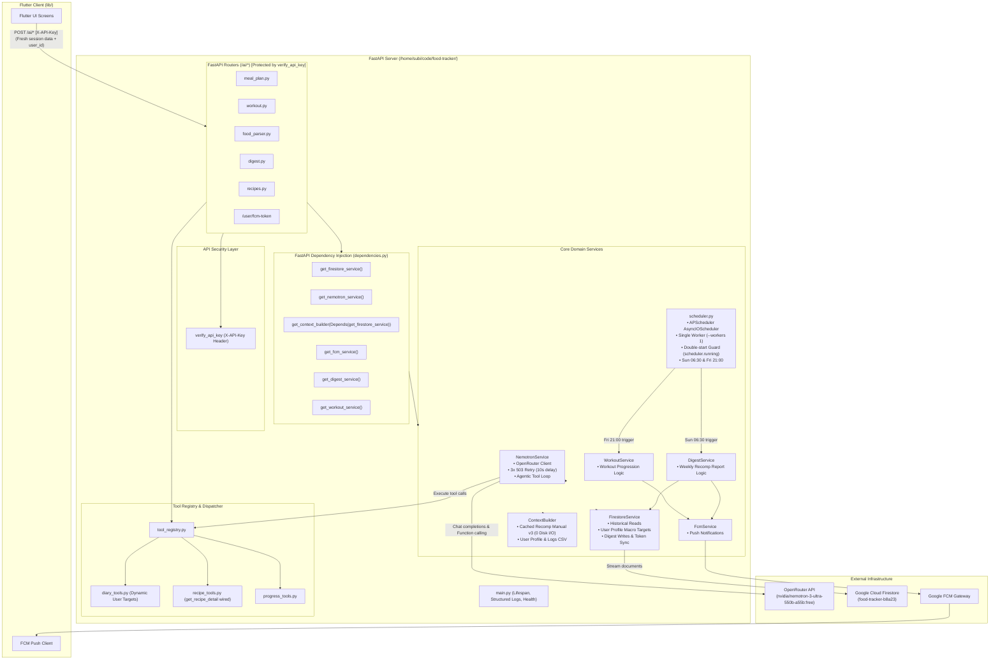

# KINETIK AI BACKEND — Master Implementation Plan (v5.0)

> **FastAPI · OpenRouter (Nemotron 3 Ultra 550B) · Google Cloud Firestore · Firebase Cloud Messaging (FCM) · APScheduler**  
> **Server Workspace Directory:** `/home/subi/code/food-tracker/`  
> **Target OS:** Ubuntu / Linux (x86_64) | **Python Runtime:** 3.12 (venv)  
> **Version:** 5.0 (Definitive Specification, Performance-Optimized & Test-Hardened)

---

## TABLE OF CONTENTS

1. [Executive Summary & Architectural Flow](#1-executive-summary--architectural-flow)
2. [Master Audit & Discrepancy Resolutions](#2-master-audit--discrepancy-resolutions)
3. [Non-Negotiable Production & Engineering Rules](#3-non-negotiable-production--engineering-rules)
4. [Firestore Collections & Schema Contracts](#4-firestore-collections--schema-contracts)
5. [Complete Project File Hierarchy](#5-complete-project-file-hierarchy)
6. [Dependencies & Environment Configuration](#6-dependencies--environment-configuration)
7. [Stage 1 — Foundation (Server, Config, Logging, Firestore, FCM, Systemd)](#7-stage-1--foundation)
8. [Stage 2 — Nemotron AI Service, Cached Context Builder, Tools & Dynamic User Targets](#8-stage-2--nemotron-ai-service-cached-context-builder-tools--dynamic-user-targets)
9. [Stage 3 — Data Models, Service Layer & Decoupled Routers with `Depends()`](#9-stage-3--data-models-service-layer--decoupled-routers-with-depends)
10. [Stage 4 — Scheduled Cron Jobs (Single Worker & Guarded Start), Token Sync & Debug Hooks](#10-stage-4--scheduled-cron-jobs-single-worker--guarded-start-token-sync--debug-hooks)
11. [Exhaustive Concrete Pytest Implementations (All 17 Test Files)](#11-exhaustive-concrete-pytest-implementations)
12. [Production Deployment, Systemd & Teardown Checklist](#12-production-deployment-systemd--teardown-checklist)

---

## 1. EXECUTIVE SUMMARY & ARCHITECTURAL FLOW

The Kinetik backend server is an AI assistant and progression engine powering the Kinetik Flutter mobile application.
- Reads historical user telemetry (diary entries, workout logs, weigh-ins, sleep data, custom recipes, and **personalized macro targets**) from Google Cloud Firestore.
- Ingests fresh real-time session inputs (`today_diary`, `today_water_ml`) directly from Flutter request payloads.
- Ingests the authoritative **Recomp Manual v3** domain knowledge base (`assets/recomp_manual_v3.txt`), cached in memory at module level for zero disk I/O during request handling.
- Orchestrates multi-turn agentic function-calling with Nvidia Nemotron 3 Ultra 550B via OpenRouter.
- Employs dedicated service-layer modules (`DigestService`, `WorkoutService`) to decouple business logic from HTTP endpoints and APScheduler jobs, eliminating circular dependencies.
- Enforces single-worker scheduling (`--workers 1`) with `scheduler.running` guards to guarantee APScheduler jobs never fire duplicate push notifications or raise `SchedulerAlreadyRunningError`.
- Employs FastAPI dependency injection (`Depends()`) across all routers for clean test isolation.
- Enforces `verify_api_key` authentication on all `/ai/*` routes when `SERVER_API_KEY` is configured, while keeping `/health` open for monitoring.
- Injects `FirestoreService` dynamically into `ContextBuilder` via `get_context_builder(Depends(get_firestore_service))` ensuring 100% test override isolation.



---

## 2. MASTER AUDIT & DISCREPANCY RESOLUTIONS

| # | Discrepancy | Severity | Root Cause | Resolution in Plan v5 |
|---|---|---|---|---|
| **1** | **`AsyncMock` Missing Import in Tests** | 🚨 Test Failure | `test_workout.py` and `test_digest.py` called `AsyncMock()` without importing it from `unittest.mock`. | Explicitly imported `AsyncMock` in both test files. |
| **2** | **503 Retry Test 10s Hang** | 🚨 Test Perf | `test_nemotron_503_retry_and_recover` executed real `asyncio.sleep(10)` during test. | Patched `app.services.nemotron_service.asyncio.sleep` with `AsyncMock` so the test executes instantly (sub-millisecond). |
| **3** | **Global Settings Mutation in Tests** | 🚨 Flaky Suite | `test_dependencies.py` mutated `settings.server_api_key` directly, causing potential 401 cascade if assertions failed. | Switched to pytest's `monkeypatch.setattr(settings, "server_api_key", ...)` for guaranteed fixture teardown. |
| **4** | **`ContextBuilder` Disk Read Per-Request** | ⚠️ Performance | `ContextBuilder.__init__` read `recomp_manual_v3.txt` from disk on every incoming request. | Cached `_MANUAL_TEXT` at module level; loaded once into memory, eliminating repeated disk I/O. |
| **5** | **Scheduler Double-Start Error** | ⚠️ Flaky Suite | Calling `start_scheduler()` in both test suite and lifespan raised `SchedulerAlreadyRunningError`. | Added `if scheduler.running: return` guard in `start_scheduler()`. |
| **6** | **`verify_api_key` Defined but Unapplied** | 🚨 Security | Defined in `dependencies.py` but never included in routes. | Wired `dependencies=[Depends(verify_api_key)]` directly into all `/ai` router mounts in `main.py`. |
| **7** | **`ContextBuilder` Mock Isolation** | ⚠️ Testability | `get_context_builder` held frozen reference to singleton `firestore_service`. | Updated `get_context_builder` to accept `Depends(get_firestore_service)`. |
| **8** | **`fiberTarget` Schema Documentation** | 📋 Schema | `make_dispatcher` read `fiberTarget` but Firestore schema omitted it. | Added `fiberTarget: int` to user document schema contract in Section 4. |
| **9** | **OpenRouter Rate Limits & Fallback** | 📋 Operational | Free tier cap (50 req/day) can be exhausted by batch digests. | Documented rate limits and configured paid fallback in `.env.example`. |
| **10** | **APScheduler `--workers 2` Double-Firing** | 🚨 Critical | Multi-worker uvicorn spawned multiple schedulers. | Set `--workers 1` in `systemd/kinetik.service`. |
| **11** | **`DAILY_TARGETS` Hardcoded** | ⚠️ Functional | User profile macro targets ignored. | Added dynamic `targets` parameter to `get_remaining_macros`. |
| **12** | **Circular Dependency: Scheduler ↔ Routers** | ⚠️ Architecture | Scheduler imported router handlers. | Extracted logic into `DigestService` and `WorkoutService`. |
| **13** | **`dependencies.py` Unused** | ⚠️ Code Quality | Routers directly imported singletons. | Wired `Depends(get_...)` across all routers. |
| **14** | **Production Config Validation** | ⚠️ Operational | App booted with placeholder keys. | Added `validate_production_config()` startup check. |
| **15** | **`get_recipe_detail` Dead Code** | 🚨 Bug | Omitted from tool schemas and dispatcher. | Wired into `TOOL_SCHEMAS` and `make_dispatcher`. |
| **16** | **Pydantic v2 `Config` Deprecation** | 📋 Deprecation | Used v1 `class Config:`. | Upgraded to `model_config = SettingsConfigDict(...)`. |
| **17** | **Duplicate `httpx` in `requirements.txt`** | 📋 Hygiene | Listed twice in requirements. | Deduplicated in `requirements.txt`. |
| **18** | **Incomplete `.gitignore`** | ⚠️ Hygiene | Build and cache artifacts missing. | Restored full `.gitignore` rules. |
| **19** | **Missing 503 Retry Logic** | 🚨 Bug | OpenRouter 503 errors not caught. | Built `_execute_with_retry` into `NemotronService`. |
| **20** | **Debug Endpoints in Production** | ⚠️ Security | Dev hooks exposed without guard. | Guarded with 404 in production mode. |
| **21** | **Dropped CLI Verification Commands** | ⚠️ Process | Hard stage verification gates lost. | Restored explicit CLI commands for all stages. |
| **22** | **Structured Logging** | ⚠️ Observability | No logging framework. | Standardized Python structured logging across services. |

---

## 3. NON-NEGOTIABLE PRODUCTION & ENGINEERING RULES

1. **Zero Hardcoded Secrets**: All API keys, tokens, project IDs, credentials paths, and endpoints live strictly in `.env`.
2. **Git Cleanliness**: `.env` and `service-account.json` MUST NEVER be committed. If `.env` appears in `git status` or `git diff`, STOP immediately.
3. **No Direct OpenRouter Access in Routers**: Routers MUST ALWAYS call `NemotronService`.
4. **No Direct Firestore Queries in Routers/Tools**: All Firestore calls MUST happen inside `FirestoreService` methods only. Never import or use `db` directly in routers, tools, or `context_builder`.
5. **Fresh Request Data Precedence**: `today_diary` ALWAYS comes from the Flutter request payload (`req.today_diary`), NEVER from Firestore. Flutter syncs asynchronously; the mobile app sends the canonical current day's log.
6. **Defensive AI Parsing**: Every response parsed with `json.loads()` MUST be wrapped in `try/except`. Code fence prefixes (````json ... ````) MUST be cleanly stripped. On failure, return safe empty models (`[]` or default objects), never allowing unhandled 500 crashes.
7. **Execution Timeout**: All endpoints must complete within 120 seconds or leverage async background tasks (such as digest generation).
8. **OpenRouter 503 Retries**: Intercept HTTP 503 responses from OpenRouter, pause for 10 seconds, and retry up to 3 times before re-raising.
9. **Single Worker for Scheduler**: Systemd service executes with `--workers 1` to prevent APScheduler job duplication.
10. **Service-Layer Separation**: Business logic shared between HTTP routers and scheduled cron jobs resides in `app/services/` (`DigestService`, `WorkoutService`), preventing circular imports.
11. **Dependency Injection**: Routers use FastAPI `Depends()` for all service dependencies.
12. **API Authentication**: All `/ai/*` routes require `X-API-Key` matching `SERVER_API_KEY` when configured.
13. **100% Test Coverage**: Every single code file MUST have a corresponding comprehensive test file in `tests/`.

---

## 4. FIRESTORE COLLECTIONS & SCHEMA CONTRACTS

The backend interacts with Firestore project `food-tracker-b8a23` exclusively through `FirestoreService`:

| Collection Path | Operation | Key Fields | Purpose |
|---|---|---|---|
| `users/{uid}` | Read / Update | `calorieTarget`, `proteinTarget`, `carbTarget`, `fatTarget`, `fiberTarget`, `fcmToken` | User profile & custom macro targets |
| `users/{uid}/diary_entries` | Read | `date`, `mealSlot`, `foodName`, `calories`, `proteinG`, `carbsG`, `fatG`, `fiberG` | Historical nutrition log |
| `users/{uid}/workouts` | Read | `date`, `name`, `durationMin`, `caloriesBurned` | Workout session summaries |
| `users/{uid}/workout_set_logs` | Read | `date`, `sessionId`, `exerciseName`, `setIndex`, `reps`, `weightKg`, `rpe` | Progressive overload tracking |
| `users/{uid}/weigh_ins` | Read | `date`, `weightKg`, `bodyFatPct` | Body weight trend analysis |
| `users/{uid}/measurements` | Read | `date`, `type`, `valueCm` | Body tape measurements |
| `users/{uid}/water_logs` | Read | `date`, `amountMl` | Daily hydration history |
| `users/{uid}/sleep_logs` | Read | `date`, `durationHours`, `recoveryScore` | Recovery monitoring |
| `users/{uid}/recipes` | Read | `id`, `name`, `tamilName`, `mealSlot`, `calories`, `proteinG`, `carbsG`, `fatG` | Custom recipe database |
| `users/{uid}/ai_digests` | **Write** | `week`, `content`, `generatedAt` | Sunday weekly report cache |

---

## 5. COMPLETE PROJECT FILE HIERARCHY

```
/home/subi/code/food-tracker/
├── main.py                               # FastAPI application entrypoint, lifespan, auth & logging
├── .env                                  # Local environment secrets (NEVER COMMITTED)
├── .env.example                          # Environment template (COMMITTED)
├── .gitignore                            # Git exclusion rules
├── requirements.txt                      # Deduplicated package dependencies
├── IMPLEMENTATION_PLAN.md                # This master document
├── assets/
│   ├── icons/                            # Flutter asset icons
│   └── recomp_manual_v3.txt              # Plain text extract of Recomp_Manual_v3.html
├── systemd/
│   └── kinetik.service                   # Systemd service unit file (--workers 1)
├── app/
│   ├── __init__.py                       # Package initializer
│   ├── config.py                         # Pydantic SettingsConfigDict configuration & validation
│   ├── dependencies.py                   # FastAPI dependency injection providers & API key verification
│   ├── services/
│   │   ├── __init__.py
│   │   ├── firestore_service.py          # Firestore client operations & token management
│   │   ├── nemotron_service.py           # OpenRouter completion with 503 retry & agent loop
│   │   ├── context_builder.py            # Cached aggregator for domain manual, profile, & history CSV
│   │   ├── fcm_service.py                # Firebase Cloud Messaging push notifications
│   │   ├── digest_service.py             # Weekly digest business logic (decoupled from router)
│   │   ├── workout_service.py            # Workout progression business logic (decoupled)
│   │   └── scheduler.py                  # APScheduler async cron jobs with double-start guard
│   ├── tools/
│   │   ├── __init__.py
│   │   ├── diary_tools.py                # get_remaining_macros (using per-user profile targets)
│   │   ├── recipe_tools.py               # search_recipes, get_gap_filler_snacks, get_recipe_detail
│   │   ├── progress_tools.py             # get_weight_trend, get_workout_trend, get_adherence_flags
│   │   └── tool_registry.py              # OpenAI tool schemas & dispatcher factory
│   ├── routers/
│   │   ├── __init__.py
│   │   ├── meal_plan.py                  # POST /ai/meal-plan (using Depends)
│   │   ├── workout.py                    # POST /ai/workout-progression (using Depends)
│   │   ├── food_parser.py                # POST /ai/parse-food (using Depends)
│   │   ├── digest.py                     # POST /ai/weekly-digest/trigger & GET /ai/weekly-digest/{uid}/{week}
│   │   └── recipes.py                    # POST /ai/verify-recipes (using Depends)
│   └── models/
│       ├── __init__.py
│       ├── requests.py                   # Pydantic request models
│       └── responses.py                  # Pydantic response models
└── tests/
    ├── __init__.py                       # Test package initializer
    ├── conftest.py                       # Pytest fixtures and mock service helpers
    ├── test_config.py                    # Settings validation & production guard tests
    ├── test_dependencies.py              # Dependency injection & monkeypatched API key tests
    ├── test_firestore_service.py         # Firestore CRUD and error handling tests
    ├── test_fcm_service.py               # FCM dispatch tests
    ├── test_nemotron_service.py          # OpenRouter completion and instant 503 retry tests
    ├── test_context_builder.py           # Context assembly and CSV generation tests
    ├── test_digest_service.py            # Digest service business logic tests
    ├── test_workout_service.py           # Workout service business logic tests
    ├── test_tools.py                     # Algorithmic tests for all 6 tools with user targets
    ├── test_meal_plan.py                 # Meal plan endpoint tests (normal & corrupted AI response)
    ├── test_workout.py                   # Workout progression endpoint tests (AsyncMock imported)
    ├── test_food_parser.py               # NLP food parser endpoint tests
    ├── test_digest.py                    # Weekly digest trigger & retrieval tests (AsyncMock imported)
    ├── test_recipes.py                   # Recipe verification endpoint tests
    ├── test_scheduler.py                 # Scheduler cron configuration and runner tests
    └── test_main.py                      # Health endpoint, dev debug routes, and FCM token tests
```

---

## 6. DEPENDENCIES & ENVIRONMENT CONFIGURATION

### 6.1 `requirements.txt`
```text
fastapi==0.115.0
uvicorn[standard]==0.32.0
openai==1.54.0
google-cloud-firestore==2.19.0
firebase-admin==6.6.0
apscheduler==3.10.4
python-dotenv==1.0.1
pydantic==2.9.0
pydantic-settings==2.6.0
httpx==0.27.0
pytest==8.3.0
pytest-asyncio==0.24.0
```

### 6.2 `.gitignore` Additions
Ensure the following lines exist in `/home/subi/code/food-tracker/.gitignore`:
```gitignore
# Backend / Python
.env
venv/
__pycache__/
*.pyc
*.pyo
.pytest_cache/
*.egg-info/
dist/
build/
*.service.local
service-account.json
```

### 6.3 `.env.example`
```env
OPENROUTER_API_KEY=sk-or-your-key-here
OPENROUTER_BASE_URL=https://openrouter.ai/api/v1
# Free tier model: 50 requests/day limit. For higher volume, switch to paid tier:
# NEMOTRON_MODEL=nvidia/nemotron-3-ultra-550b-a55b
NEMOTRON_MODEL=nvidia/nemotron-3-ultra-550b-a55b:free
AI_TIMEOUT_SECONDS=120

GOOGLE_APPLICATION_CREDENTIALS=/home/subi/code/food-tracker/service-account.json
FIREBASE_PROJECT_ID=food-tracker-b8a23

SERVER_HOST=0.0.0.0
SERVER_PORT=8000
ENVIRONMENT=development
SERVER_API_KEY=your-secret-api-key-here

RECOMP_MANUAL_PATH=assets/recomp_manual_v3.txt
```

---

## 7. STAGE 1 — FOUNDATION
**Goal:** Running FastAPI server with structured logging, production configuration validation, Firestore client initialized, FCM sender configured, `/health` returning 200, systemd unit file with `--workers 1`.  
**Done When:**
1. `uvicorn main:app --reload` starts cleanly.
2. `curl http://localhost:8000/health` returns `{"status":"ok","model":"nvidia/nemotron-3-ultra-550b-a55b:free"}`.
3. `python3 -c "from app.services.firestore_service import firestore_service; print('Connected')"` executes successfully.
4. All Stage 1 unit tests (`test_config.py`, `test_dependencies.py`, `test_firestore_service.py`, `test_fcm_service.py`, `test_main.py`) pass with 100% success rate.

### 7.1 Domain Asset Extraction
Extract plain text from `/home/subi/code/food-tracker/Recomp_Manual_v3.html` into `assets/recomp_manual_v3.txt`.

### 7.2 Code Implementation: `app/config.py`
```python
import logging
import os
from pydantic_settings import BaseSettings, SettingsConfigDict

class Settings(BaseSettings):
    openrouter_api_key: str = "sk-or-dummy-key"
    openrouter_base_url: str = "https://openrouter.ai/api/v1"
    nemotron_model: str = "nvidia/nemotron-3-ultra-550b-a55b:free"
    ai_timeout_seconds: int = 120
    google_application_credentials: str = "service-account.json"
    firebase_project_id: str = "food-tracker-b8a23"
    server_host: str = "0.0.0.0"
    server_port: int = 8000
    environment: str = "development"
    server_api_key: str | None = None
    recomp_manual_path: str = "assets/recomp_manual_v3.txt"

    model_config = SettingsConfigDict(
        env_file=".env",
        env_file_encoding="utf-8",
        extra="ignore"
    )

    def validate_production_config(self):
        """Ensures production environment fails fast if secrets or credentials are unconfigured."""
        if self.environment.lower() == "production":
            if not self.openrouter_api_key or "dummy" in self.openrouter_api_key:
                raise RuntimeError("PRODUCTION CONFIG ERROR: OPENROUTER_API_KEY is not configured in .env")
            if not os.path.exists(self.google_application_credentials):
                raise RuntimeError(f"PRODUCTION CONFIG ERROR: Google credentials file '{self.google_application_credentials}' not found.")

logging.basicConfig(
    level=logging.INFO,
    format="%(asctime)s [%(levelname)s] %(name)s: %(message)s",
)
logger = logging.getLogger("kinetik")

settings = Settings()
```

### 7.3 Code Implementation: `app/dependencies.py`
```python
from fastapi import Header, HTTPException, Depends
from app.config import settings
from app.services.firestore_service import firestore_service, FirestoreService
from app.services.nemotron_service import nemotron_service, NemotronService
from app.services.context_builder import ContextBuilder
from app.services.fcm_service import fcm_service, FcmService
from app.services.digest_service import digest_service, DigestService
from app.services.workout_service import workout_service, WorkoutService

def get_firestore_service() -> FirestoreService:
    return firestore_service

def get_nemotron_service() -> NemotronService:
    return nemotron_service

def get_context_builder(
    firestore_svc: FirestoreService = Depends(get_firestore_service),
) -> ContextBuilder:
    """Instantiates ContextBuilder using injected FirestoreService for full test isolation."""
    return ContextBuilder(firestore_svc=firestore_svc)

def get_fcm_service() -> FcmService:
    return fcm_service

def get_digest_service() -> DigestService:
    return digest_service

def get_workout_service() -> WorkoutService:
    return workout_service

async def verify_api_key(x_api_key: str | None = Header(default=None)):
    """Enforces API key authentication on protected routes if SERVER_API_KEY is configured."""
    if settings.server_api_key:
        if not x_api_key or x_api_key != settings.server_api_key:
            raise HTTPException(status_code=401, detail="Invalid or missing X-API-Key header")
    return True
```

### 7.4 Code Implementation: `app/services/firestore_service.py`
```python
import os
from datetime import datetime, timedelta
import firebase_admin
from firebase_admin import credentials, firestore as fs
from app.config import settings, logger

# Initialize Firebase Admin singleton defensively
if not firebase_admin._apps:
    if os.path.exists(settings.google_application_credentials):
        cred = credentials.Certificate(settings.google_application_credentials)
        firebase_admin.initialize_app(cred, {"projectId": settings.firebase_project_id})
    else:
        # Allows local imports and test suites without crashing
        try:
            firebase_admin.initialize_app(options={"projectId": settings.firebase_project_id})
        except Exception as e:
            logger.warning("Firebase Admin default init fallback: %s", e)

try:
    db = fs.client()
except Exception:
    db = None

class FirestoreService:
    def __init__(self, client=None):
        self._db = client

    @property
    def db(self):
        return self._db if self._db is not None else db

    # ── reads ────────────────────────────────────────────────────────

    def get_user_profile(self, user_id: str) -> dict:
        if not self.db:
            return {}
        doc = self.db.collection("users").document(user_id).get()
        return doc.to_dict() or {}

    def get_all_users(self) -> list[dict]:
        if not self.db:
            return []
        docs = self.db.collection("users").stream()
        return [{"id": doc.id, **doc.to_dict()} for doc in docs]

    def get_diary_history(self, user_id: str, days: int = 30) -> list[dict]:
        if not self.db:
            return []
        cutoff = (datetime.now() - timedelta(days=days)).strftime("%Y-%m-%d")
        docs = (
            self.db.collection("users").document(user_id)
            .collection("diary_entries")
            .where("date", ">=", cutoff)
            .order_by("date", direction=fs.Query.DESCENDING)
            .stream()
        )
        return [doc.to_dict() for doc in docs]

    def get_workout_history(self, user_id: str, days: int = 60) -> list[dict]:
        if not self.db:
            return []
        cutoff = (datetime.now() - timedelta(days=days)).strftime("%Y-%m-%d")
        docs = (
            self.db.collection("users").document(user_id)
            .collection("workout_set_logs")
            .where("date", ">=", cutoff)
            .stream()
        )
        return [doc.to_dict() for doc in docs]

    def get_weigh_ins(self, user_id: str, count: int = 12) -> list[dict]:
        if not self.db:
            return []
        docs = (
            self.db.collection("users").document(user_id)
            .collection("weigh_ins")
            .order_by("date", direction=fs.Query.DESCENDING)
            .limit(count)
            .stream()
        )
        return [doc.to_dict() for doc in docs]

    def get_sleep_logs(self, user_id: str, days: int = 21) -> list[dict]:
        if not self.db:
            return []
        cutoff = (datetime.now() - timedelta(days=days)).strftime("%Y-%m-%d")
        docs = (
            self.db.collection("users").document(user_id)
            .collection("sleep_logs")
            .where("date", ">=", cutoff)
            .stream()
        )
        return [doc.to_dict() for doc in docs]

    def get_recipes(self, user_id: str) -> list[dict]:
        if not self.db:
            return []
        docs = (
            self.db.collection("users").document(user_id)
            .collection("recipes")
            .stream()
        )
        return [doc.to_dict() for doc in docs]

    # ── writes ───────────────────────────────────────────────────────

    def save_digest(self, user_id: str, week: str, content: dict):
        if not self.db:
            return
        self.db.collection("users").document(user_id) \
            .collection("ai_digests").document(week) \
            .set({**content, "generatedAt": datetime.now().isoformat()})

    def get_digest(self, user_id: str, week: str) -> dict | None:
        if not self.db:
            return None
        doc = self.db.collection("users").document(user_id) \
            .collection("ai_digests").document(week).get()
        return doc.to_dict() if doc.exists else None

    def update_fcm_token(self, user_id: str, fcm_token: str):
        if not self.db:
            return
        self.db.collection("users").document(user_id).update({"fcmToken": fcm_token})

firestore_service = FirestoreService()
```

### 7.5 Code Implementation: `app/services/fcm_service.py`
```python
from firebase_admin import messaging
from app.config import logger

class FcmService:
    def _send(self, token: str, title: str, body: str, data: dict):
        if not token:
            return
        try:
            messaging.send(messaging.Message(
                notification=messaging.Notification(title=title, body=body),
                data={str(k): str(v) for k, v in data.items()},
                token=token,
            ))
            logger.info("FCM push sent successfully to %s: %s", token[:8] + "...", title)
        except Exception as e:
            logger.error("FCM send failed: %s", e)

    def send_digest_ready(self, fcm_token: str, week: str):
        self._send(
            fcm_token,
            "Weekly Report Ready",
            f"Your recomp report for week {week} is ready.",
            {"action": "open_weekly_digest", "week": week},
        )

    def send_progression_ready(self, fcm_token: str):
        self._send(
            fcm_token,
            "Workout Plan Ready",
            "Your next week progression plan is ready.",
            {"action": "open_progression_card"},
        )

fcm_service = FcmService()
```

### 7.6 Code Implementation: `main.py`
```python
from contextlib import asynccontextmanager
from fastapi import FastAPI, HTTPException, Depends
from pydantic import BaseModel
from app.config import settings, logger
from app.routers import meal_plan, workout, food_parser, digest, recipes
from app.services.firestore_service import FirestoreService
from app.dependencies import (
    get_firestore_service,
    get_digest_service,
    get_workout_service,
    verify_api_key,
)
from app.services.digest_service import DigestService
from app.services.workout_service import WorkoutService

@asynccontextmanager
async def lifespan(app: FastAPI):
    settings.validate_production_config()
    from app.services.scheduler import start_scheduler, shutdown_scheduler
    start_scheduler()
    yield
    shutdown_scheduler()

app = FastAPI(title="Kinetik AI Server", version="1.0.0", lifespan=lifespan)

# Protected AI Routers: require X-API-Key when SERVER_API_KEY is configured
api_dependencies = [Depends(verify_api_key)]

app.include_router(meal_plan.router,   prefix="/ai", tags=["AI"], dependencies=api_dependencies)
app.include_router(workout.router,     prefix="/ai", tags=["AI"], dependencies=api_dependencies)
app.include_router(food_parser.router, prefix="/ai", tags=["AI"], dependencies=api_dependencies)
app.include_router(digest.router,      prefix="/ai", tags=["AI"], dependencies=api_dependencies)
app.include_router(recipes.router,     prefix="/ai", tags=["AI"], dependencies=api_dependencies)

@app.get("/health")
async def health():
    """Unauthenticated health check for uptime monitors & load balancers."""
    return {"status": "ok", "model": settings.nemotron_model}

class FcmTokenUpdate(BaseModel):
    user_id: str
    fcm_token: str

@app.post("/user/fcm-token", dependencies=api_dependencies)
async def update_fcm_token(
    body: FcmTokenUpdate,
    firestore_svc: FirestoreService = Depends(get_firestore_service),
):
    firestore_svc.update_fcm_token(body.user_id, body.fcm_token)
    return {"status": "updated"}

# ── DEBUG HOOKS (DEV ONLY — REMOVE OR GUARD BEFORE PROD) ────────────

@app.post("/debug/trigger-digest", dependencies=api_dependencies)
async def debug_trigger_digest(digest_svc: DigestService = Depends(get_digest_service)):
    """Dev only — manually fire the Sunday digest job."""
    if settings.environment == "production":
        raise HTTPException(status_code=404, detail="Not found")
    await digest_svc.run_weekly_digests()
    return {"status": "digest jobs completed"}

@app.post("/debug/trigger-progression", dependencies=api_dependencies)
async def debug_trigger_progression(workout_svc: WorkoutService = Depends(get_workout_service)):
    """Dev only — manually fire the Friday progression job."""
    if settings.environment == "production":
        raise HTTPException(status_code=404, detail="Not found")
    await workout_svc.run_workout_progressions()
    return {"status": "progression jobs completed"}
```

### 7.7 Code Implementation: `systemd/kinetik.service`
```ini
[Unit]
Description=Kinetik AI Backend Server
After=network.target

[Service]
Type=simple
User=subi
WorkingDirectory=/home/subi/code/food-tracker
Environment="SERVER_HOST=0.0.0.0" "SERVER_PORT=8000"
EnvironmentFile=-/home/subi/code/food-tracker/.env
ExecStart=/home/subi/code/food-tracker/venv/bin/uvicorn main:app --host ${SERVER_HOST} --port ${SERVER_PORT} --workers 1
Restart=always
RestartSec=5

[Install]
WantedBy=multi-user.target
```

### 7.8 Stage 1 Verification Checklist
```bash
# 1. Start server locally (reads SERVER_HOST and SERVER_PORT dynamically from .env / config)
venv/bin/python main.py &
PID=$!
sleep 2

# 2. Query health check (using the configured SERVER_PORT)
curl -s http://localhost:${SERVER_PORT:-8000}/health
# Expected Output: {"status":"ok","model":"nvidia/nemotron-3-ultra-550b-a55b:free"}

# 3. Test Firestore import and connectivity
venv/bin/python3 -c "
from app.services.firestore_service import firestore_service
print('Firestore service loaded successfully. DB client initialized.')
"

kill $PID

# 4. Execute Stage 1 test suite
venv/bin/pytest tests/test_config.py tests/test_dependencies.py tests/test_firestore_service.py tests/test_fcm_service.py tests/test_main.py -v
```

---

## 8. STAGE 2 — NEMOTRON AI SERVICE, CACHED CONTEXT BUILDER, TOOLS & DYNAMIC USER TARGETS
**Goal:** Nemotron 3 Ultra 550B client with 503 retry policy and agent loop. Memory-cached domain context builder for zero disk I/O per request. Full 6-tool suite tested and validated with dynamic user macro targets.  
**Done When:**
1. All tool tests (`tests/test_tools.py`) pass with 100% deterministic mathematical accuracy for both custom user targets and Recomp fallbacks.
2. `tests/test_nemotron_service.py` verifies both single-turn completion and agent tool loop with instant 503 retry intercept.
3. `tests/test_context_builder.py` confirms clean tabular CSV outputs for empty and populated data sets without re-reading disk.

### 8.1 Code Implementation: `app/services/nemotron_service.py`
```python
import asyncio
import json
from openai import AsyncOpenAI, APIStatusError
from app.config import settings, logger

class NemotronService:
    def __init__(self, client: AsyncOpenAI = None):
        self._client = client or AsyncOpenAI(
            api_key=settings.openrouter_api_key,
            base_url=settings.openrouter_base_url,
            default_headers={
                "HTTP-Referer": "com.kinetik.fitnessapp",
                "X-Title": "Kinetik Fitness",
            },
            timeout=settings.ai_timeout_seconds,
        )

    async def _execute_with_retry(self, api_call_coro):
        """Retries on HTTP 503 up to 3 attempts with 10-second delay."""
        max_attempts = 3
        for attempt in range(1, max_attempts + 1):
            try:
                return await api_call_coro()
            except APIStatusError as e:
                if e.status_code == 503 and attempt < max_attempts:
                    logger.warning(
                        "OpenRouter returned 503. Retrying in 10s (attempt %d/%d)...",
                        attempt, max_attempts
                    )
                    await asyncio.sleep(10)
                else:
                    raise
            except Exception:
                raise

    async def complete(
        self,
        system: str,
        user: str,
        max_tokens: int = 2000,
    ) -> str:
        """Single-turn completion. No tool use."""
        async def _call():
            response = await self._client.chat.completions.create(
                model=settings.nemotron_model,
                messages=[
                    {"role": "system", "content": system},
                    {"role": "user",   "content": user},
                ],
                max_tokens=max_tokens,
            )
            return response.choices[0].message.content or ""

        try:
            return await self._execute_with_retry(_call)
        except Exception as e:
            raise RuntimeError(f"Nemotron complete failed: {e}") from e

    async def run_agent_loop(
        self,
        system: str,
        user: str,
        tools: list[dict],
        tool_dispatcher,
        max_iterations: int = 10,
    ) -> str:
        """
        Full agentic loop with tool dispatch and 503 retry protection.
        tool_dispatcher: async callable(name: str, args: dict) -> any
        """
        messages = [
            {"role": "system", "content": system},
            {"role": "user",   "content": user},
        ]
        last_content = ""

        try:
            for _ in range(max_iterations):
                async def _call():
                    return await self._client.chat.completions.create(
                        model=settings.nemotron_model,
                        messages=messages,
                        tools=tools,
                        tool_choice="auto",
                        max_tokens=4000,
                    )

                response = await self._execute_with_retry(_call)
                choice = response.choices[0]
                last_content = choice.message.content or ""

                if choice.finish_reason == "stop":
                    return last_content

                if choice.finish_reason == "tool_calls" and choice.message.tool_calls:
                    messages.append(choice.message)
                    for tc in choice.message.tool_calls:
                        try:
                            args = json.loads(tc.function.arguments)
                        except Exception:
                            args = {}
                        result = await tool_dispatcher(tc.function.name, args)
                        messages.append({
                            "role": "tool",
                            "tool_call_id": tc.id,
                            "content": json.dumps(result),
                        })

        except Exception as e:
            raise RuntimeError(f"Nemotron agent loop failed: {e}") from e

        return last_content

nemotron_service = NemotronService()
```

### 8.2 Code Implementation: `app/services/context_builder.py`
Caches the Recomp Manual in memory at module load for optimal request performance:
```python
import json
from pathlib import Path
from app.config import settings
from app.services.firestore_service import firestore_service

# Pre-load and cache the recomp manual into memory once at startup
_MANUAL_CACHE: str = ""
_manual_path = Path(settings.recomp_manual_path)
if _manual_path.exists():
    try:
        _MANUAL_CACHE = _manual_path.read_text(encoding="utf-8")
    except Exception:
        _MANUAL_CACHE = ""

class ContextBuilder:
    def __init__(self, manual_text: str = None, firestore_svc=None):
        self._manual_text = manual_text if manual_text is not None else _MANUAL_CACHE
        self._fs = firestore_svc or firestore_service

    def build(
        self,
        user_id: str,
        include_diary: bool = True,
        include_workouts: bool = True,
        include_weigh_ins: bool = True,
        include_sleep: bool = False,
        diary_days: int = 30,
    ) -> str:
        profile = self._fs.get_user_profile(user_id)
        recipes = self._fs.get_recipes(user_id)

        parts = [
            "# RECOMP MANUAL v3\n" + self._manual_text,
            "\n\n# USER PROFILE\n" + json.dumps(profile, indent=2),
            "\n\n# RECIPE DATABASE\n" + self._recipes_csv(recipes),
        ]

        if include_diary:
            data = self._fs.get_diary_history(user_id, days=diary_days)
            parts.append(f"\n\n# DIARY HISTORY (last {diary_days} days)\n" + self._to_csv(data))

        if include_workouts:
            data = self._fs.get_workout_history(user_id, days=60)
            parts.append("\n\n# WORKOUT SET LOGS (last 60 days)\n" + self._to_csv(data))

        if include_weigh_ins:
            data = self._fs.get_weigh_ins(user_id, count=12)
            parts.append("\n\n# WEIGH-INS\n" + self._to_csv(data))

        if include_sleep:
            data = self._fs.get_sleep_logs(user_id, days=21)
            parts.append("\n\n# SLEEP LOGS (last 21 days)\n" + self._to_csv(data))

        return "".join(parts)

    def _recipes_csv(self, recipes: list[dict]) -> str:
        lines = ["name,mealSlot,calories,proteinG,carbsG,fatG"]
        for r in recipes:
            lines.append(
                f"{r.get('name','')},{r.get('mealSlot','')},{r.get('calories',0)},"
                f"{r.get('proteinG',0)},{r.get('carbsG',0)},{r.get('fatG',0)}"
            )
        return "\n".join(lines)

    def _to_csv(self, records: list[dict]) -> str:
        if not records:
            return "(no records)"
        keys = list(records[0].keys())
        rows = [",".join(keys)]
        for r in records:
            rows.append(",".join(str(r.get(k, "")) for k in keys))
        return "\n".join(rows)

context_builder = ContextBuilder()
```

### 8.3 Code Implementation: `app/tools/diary_tools.py`
```python
DEFAULT_TARGETS = {
    "calories": 2350.0,
    "proteinG":  155.0,
    "carbsG":    260.0,
    "fatG":       70.0,
    "fiberG":     35.0,
}

async def get_remaining_macros(today_diary: list[dict], targets: dict | None = None) -> dict:
    active_targets = dict(DEFAULT_TARGETS)
    if targets:
        for k, v in targets.items():
            if v is not None:
                active_targets[k] = float(v)

    consumed = {k: 0.0 for k in active_targets}
    for entry in today_diary:
        for k in active_targets:
            consumed[k] += float(entry.get(k, 0))

    remaining = {k: round(active_targets[k] - consumed[k], 1) for k in active_targets}
    return {
        "consumed":  {k: round(v, 1) for k, v in consumed.items()},
        "remaining": remaining,
        "targets":   active_targets,
    }
```

### 8.4 Code Implementation: `app/tools/recipe_tools.py`
```python
async def search_recipes(
    recipes: list[dict],
    meal_slot: str,
    max_cal: int = 9999,
    min_protein: int = 0,
) -> list[dict]:
    results = [
        r for r in recipes
        if r.get("mealSlot") == meal_slot
        and float(r.get("calories", 9999)) <= max_cal
        and float(r.get("proteinG", 0)) >= min_protein
    ]
    return sorted(results, key=lambda r: float(r.get("proteinG", 0)), reverse=True)[:5]

async def get_gap_filler_snacks(
    recipes: list[dict],
    remaining_cal: int,
    remaining_protein: int,
) -> list[dict]:
    snacks = [r for r in recipes if r.get("mealSlot") == "snack"]

    def score(r: dict) -> float:
        cal_diff  = abs(float(r.get("calories", 0)) - remaining_cal)
        prot_diff = abs(float(r.get("proteinG", 0)) - remaining_protein)
        return cal_diff + prot_diff * 2.0

    return sorted(snacks, key=score)[:3]

async def get_recipe_detail(recipes: list[dict], recipe_name: str) -> dict:
    for r in recipes:
        if r.get("name", "").lower() == recipe_name.lower():
            return r
    return {}
```

### 8.5 Code Implementation: `app/tools/progress_tools.py`
```python
from statistics import mean

async def get_weight_trend(weigh_ins: list[dict], weeks: int = 4) -> dict:
    sorted_ins = sorted(weigh_ins, key=lambda w: w.get("date", ""))
    weights = [float(w["weightKg"]) for w in sorted_ins if w.get("weightKg")]
    if not weights:
        return {"trend": [], "delta": 0.0, "latest_avg": None}

    rolling = [
        round(mean(weights[max(0, i - 2): i + 1]), 2)
        for i in range(len(weights))
    ]
    delta = round(rolling[-1] - rolling[0], 2) if len(rolling) > 1 else 0.0
    return {"trend": rolling, "delta": delta, "latest_avg": rolling[-1]}

async def get_workout_trend(
    workout_logs: list[dict],
    exercise_name: str,
) -> list[dict]:
    matches = [
        w for w in workout_logs
        if w.get("exerciseName", "").lower() == exercise_name.lower()
    ]
    return sorted(matches, key=lambda w: w.get("date", ""), reverse=True)[:5]

async def get_adherence_flags(weigh_ins: list[dict]) -> dict:
    sorted_ins = sorted(weigh_ins, key=lambda w: w.get("date", ""))
    weights = [float(w["weightKg"]) for w in sorted_ins if w.get("weightKg")]

    plateau = False
    delta_3wk = None
    if len(weights) >= 3:
        delta_3wk = round(weights[-1] - weights[-3], 2)
        plateau = abs(delta_3wk) <= 0.25

    return {
        "plateau_detected": plateau,
        "weight_delta_3wk": delta_3wk,
    }
```

### 8.6 Code Implementation: `app/tools/tool_registry.py`
```python
from app.tools.diary_tools    import get_remaining_macros
from app.tools.recipe_tools   import search_recipes, get_gap_filler_snacks, get_recipe_detail
from app.tools.progress_tools import get_weight_trend, get_workout_trend, get_adherence_flags

TOOL_SCHEMAS = [
    {
        "type": "function",
        "function": {
            "name": "get_remaining_macros",
            "description": "Returns today's remaining macros vs athlete's target macros.",
            "parameters": {
                "type": "object",
                "properties": {
                    "today_diary": {"type": "array", "description": "List of meal entries logged today"}
                },
                "required": ["today_diary"],
            },
        },
    },
    {
        "type": "function",
        "function": {
            "name": "search_recipes",
            "description": "Search recipes by meal slot, max calories, and minimum protein.",
            "parameters": {
                "type": "object",
                "properties": {
                    "meal_slot":   {"type": "string", "enum": ["breakfast", "lunch", "dinner", "snack"]},
                    "max_cal":     {"type": "integer"},
                    "min_protein": {"type": "integer"},
                },
                "required": ["meal_slot"],
            },
        },
    },
    {
        "type": "function",
        "function": {
            "name": "get_gap_filler_snacks",
            "description": "Returns top 3 snacks that best close remaining calorie and protein gap.",
            "parameters": {
                "type": "object",
                "properties": {
                    "remaining_cal":     {"type": "integer"},
                    "remaining_protein": {"type": "integer"},
                },
                "required": ["remaining_cal", "remaining_protein"],
            },
        },
    },
    {
        "type": "function",
        "function": {
            "name": "get_recipe_detail",
            "description": "Returns detailed nutrition profile for an exact recipe name.",
            "parameters": {
                "type": "object",
                "properties": {
                    "recipe_name": {"type": "string", "description": "Exact name of the recipe"}
                },
                "required": ["recipe_name"],
            },
        },
    },
    {
        "type": "function",
        "function": {
            "name": "get_weight_trend",
            "description": "Returns rolling average weight trend and total delta.",
            "parameters": {
                "type": "object",
                "properties": {"weeks": {"type": "integer", "default": 4}},
            },
        },
    },
    {
        "type": "function",
        "function": {
            "name": "get_workout_trend",
            "description": "Returns last 5 logged sessions for a named exercise.",
            "parameters": {
                "type": "object",
                "properties": {
                    "exercise_name": {"type": "string"}
                },
                "required": ["exercise_name"],
            },
        },
    },
    {
        "type": "function",
        "function": {
            "name": "get_adherence_flags",
            "description": "Returns plateau detection flag and 3-week weight delta.",
            "parameters": {"type": "object", "properties": {}},
        },
    },
]

def make_dispatcher(
    today_diary: list[dict],
    recipes: list[dict],
    weigh_ins: list[dict],
    workout_logs: list[dict],
    user_profile: dict | None = None,
):
    """
    Returns an async dispatcher pre-loaded with request context.
    Extracts custom user targets from user_profile if available.
    """
    user_targets = None
    if user_profile:
        user_targets = {
            "calories": user_profile.get("calorieTarget"),
            "proteinG": user_profile.get("proteinTarget"),
            "carbsG":   user_profile.get("carbTarget"),
            "fatG":     user_profile.get("fatTarget"),
            "fiberG":   user_profile.get("fiberTarget"),
        }

    async def dispatcher(name: str, args: dict):
        if name == "get_remaining_macros":
            return await get_remaining_macros(today_diary, targets=user_targets)
        if name == "search_recipes":
            return await search_recipes(recipes, **args)
        if name == "get_gap_filler_snacks":
            return await get_gap_filler_snacks(recipes, **args)
        if name == "get_recipe_detail":
            return await get_recipe_detail(recipes, **args)
        if name == "get_weight_trend":
            return await get_weight_trend(weigh_ins, **args)
        if name == "get_workout_trend":
            return await get_workout_trend(workout_logs, **args)
        if name == "get_adherence_flags":
            return await get_adherence_flags(weigh_ins)
        return {"error": f"Unknown tool: {name}"}

    return dispatcher
```

### 8.7 Stage 2 Verification Checklist
```bash
# 1. Run tool algorithmic and math tests
venv/bin/pytest tests/test_tools.py -v

# 2. Run context builder tests
venv/bin/pytest tests/test_context_builder.py -v

# 3. Run Nemotron mock & retry tests
venv/bin/pytest tests/test_nemotron_service.py -v
```

---

## 9. STAGE 3 — DATA MODELS, SERVICE LAYER & DECOUPLED ROUTERS WITH `Depends()`
**Goal:** Extract domain business logic into dedicated services (`DigestService`, `WorkoutService`), wire all routers with `Depends()`, parse LLM JSON responses defensively.  
**Done When:**
1. FastAPI `/docs` renders all endpoints.
2. All 5 routers import only from service layers and use `Depends()` for all service injections.
3. Corrupted JSON or markdown fences from LLM do NOT crash endpoints; safe fallbacks returned.
4. All Stage 3 tests pass (`test_meal_plan.py`, `test_workout.py`, `test_food_parser.py`, `test_digest.py`, `test_recipes.py`, `test_digest_service.py`, `test_workout_service.py`).

### 9.1 Code Implementation: `app/models/requests.py`
```python
from pydantic import BaseModel

class DiaryEntryIn(BaseModel):
    mealSlot:  str
    foodName:  str
    calories:  float
    proteinG:  float
    carbsG:    float
    fatG:      float
    fiberG:    float = 0.0

class MealPlanRequest(BaseModel):
    user_id:        str
    fcm_token:      str | None = None
    today_diary:    list[DiaryEntryIn] = []
    today_water_ml: int = 0

class WorkoutProgressionRequest(BaseModel):
    user_id:   str
    fcm_token: str | None = None

class ParseFoodRequest(BaseModel):
    user_id: str
    input:   str

class DigestTriggerRequest(BaseModel):
    user_id:   str
    fcm_token: str
    week:      str   # ISO format, e.g. "2026-W37"

class VerifyRecipesRequest(BaseModel):
    user_id: str
```

### 9.2 Code Implementation: `app/models/responses.py`
```python
from pydantic import BaseModel

class MealPlanItem(BaseModel):
    recipe_name: str
    meal_slot:   str
    calories:    float
    protein:     float
    reasoning:   str = ""

class MealPlanResponse(BaseModel):
    plan:     list[MealPlanItem]
    raw_text: str

class ExerciseProgression(BaseModel):
    name:           str
    current:        str
    recommendation: str
    reasoning:      str = ""

class WorkoutProgressionResponse(BaseModel):
    exercises: list[ExerciseProgression]
    raw_text:  str

class ParsedFoodItem(BaseModel):
    food_name:   str
    portion_qty: float = 1.0
    meal_slot:   str = "snack"

class ParseFoodResponse(BaseModel):
    items:    list[ParsedFoodItem]
    raw_text: str

class DigestResponse(BaseModel):
    week:    str
    content: str
    cached:  bool

class RecipeFlag(BaseModel):
    recipe_name:      str
    verified:         bool
    discrepancy_kcal: float = 0.0
    flag_reason:      str | None = None

class VerifyRecipesResponse(BaseModel):
    flags: list[RecipeFlag]
```

### 9.3 Code Implementation: `app/services/digest_service.py`
```python
from datetime import datetime
from app.services.nemotron_service import nemotron_service, NemotronService
from app.services.context_builder import context_builder, ContextBuilder
from app.services.firestore_service import firestore_service, FirestoreService
from app.services.fcm_service import fcm_service, FcmService
from app.config import logger

DIGEST_PROMPT = (
    "Write a weekly recomp progress report for this athlete. Cover:\n"
    "1. Nutrition adherence (protein target hit X/7 days, avg deficit/surplus).\n"
    "2. Training consistency (sessions completed vs planned 4-day split).\n"
    "3. Body composition signal (weight change — noise vs real trend).\n"
    "4. Sleep quality and likely impact on recovery this week.\n"
    "5. One specific, actionable change for next week.\n"
    "Be direct. No fluff. Max 300 words. "
    "Use Recomp Manual targets (2350 kcal, 155g protein) as baseline."
)

class DigestService:
    def __init__(
        self,
        nemotron_svc: NemotronService = None,
        context_bld: ContextBuilder = None,
        firestore_svc: FirestoreService = None,
        fcm_svc: FcmService = None,
    ):
        self._nemotron = nemotron_svc or nemotron_service
        self._context_builder = context_bld or context_builder
        self._firestore = firestore_svc or firestore_service
        self._fcm = fcm_svc or fcm_service

    async def generate_and_save(self, user_id: str, week: str, fcm_token: str):
        system = self._context_builder.build(
            user_id,
            include_diary=True,
            include_workouts=True,
            include_weigh_ins=True,
            include_sleep=True,
            diary_days=7,
        )
        try:
            content = await self._nemotron.complete(system, DIGEST_PROMPT, max_tokens=1000)
        except Exception as e:
            content = f"Digest generation failed: {e}"
            logger.error("Error generating digest for user %s: %s", user_id, e)

        self._firestore.save_digest(user_id, week, {"week": week, "content": content})
        self._fcm.send_digest_ready(fcm_token, week)

    async def run_weekly_digests(self):
        week = datetime.now().strftime("%Y-W%W")
        users = self._firestore.get_all_users()
        for user in users:
            uid = user.get("id")
            token = user.get("fcmToken", "")
            if uid:
                await self.generate_and_save(uid, week, token)

digest_service = DigestService()
```

### 9.4 Code Implementation: `app/services/workout_service.py`
```python
import json
from app.models.responses import WorkoutProgressionResponse, ExerciseProgression
from app.services.nemotron_service import nemotron_service, NemotronService
from app.services.context_builder import context_builder, ContextBuilder
from app.services.firestore_service import firestore_service, FirestoreService
from app.services.fcm_service import fcm_service, FcmService
from app.tools.tool_registry import TOOL_SCHEMAS, make_dispatcher
from app.config import logger

COMPOUND_LIFTS = [
    "Barbell Squat", "Bench Press", "Pull-ups",
    "Overhead Press", "Romanian Deadlift", "Goblet Squat",
]

class WorkoutService:
    def __init__(
        self,
        nemotron_svc: NemotronService = None,
        context_bld: ContextBuilder = None,
        firestore_svc: FirestoreService = None,
        fcm_svc: FcmService = None,
    ):
        self._nemotron = nemotron_svc or nemotron_service
        self._context_builder = context_bld or context_builder
        self._firestore = firestore_svc or firestore_service
        self._fcm = fcm_svc or fcm_service

    async def generate_workout_progression(self, user_id: str) -> WorkoutProgressionResponse:
        system = self._context_builder.build(user_id, include_diary=False, include_sleep=False)
        profile = self._firestore.get_user_profile(user_id)
        weigh_ins = self._firestore.get_weigh_ins(user_id)
        workout_logs = self._firestore.get_workout_history(user_id)
        dispatcher = make_dispatcher([], [], weigh_ins, workout_logs, profile)

        user_msg = (
            f"Use get_workout_trend for each of these exercises: {COMPOUND_LIFTS}.\n"
            "Use get_adherence_flags to check for plateau or stall.\n"
            "Return ONLY a JSON array: "
            '[{"name":"...","current":"...","recommendation":"...","reasoning":"..."}]'
        )

        try:
            raw = await self._nemotron.run_agent_loop(system, user_msg, TOOL_SCHEMAS, dispatcher)
            clean = raw.strip().removeprefix("```json").removeprefix("```").removesuffix("```").strip()
            parsed = json.loads(clean)
            exercises = parsed if isinstance(parsed, list) else parsed.get("exercises", [])
            result = [ExerciseProgression(**e) for e in exercises]
        except Exception as e:
            logger.error("Workout progression generation failed for user %s: %s", user_id, e)
            result = []
            raw = ""

        return WorkoutProgressionResponse(exercises=result, raw_text=raw)

    async def run_workout_progressions(self):
        users = self._firestore.get_all_users()
        for user in users:
            uid = user.get("id")
            token = user.get("fcmToken", "")
            if not uid:
                continue
            await self.generate_workout_progression(uid)
            self._fcm.send_progression_ready(token)

workout_service = WorkoutService()
```

### 9.5 Code Implementation: `app/routers/meal_plan.py`
```python
import json
from fastapi import APIRouter, Depends
from app.models.requests  import MealPlanRequest
from app.models.responses import MealPlanResponse, MealPlanItem
from app.services.nemotron_service import NemotronService
from app.services.context_builder  import ContextBuilder
from app.services.firestore_service import FirestoreService
from app.dependencies import get_nemotron_service, get_context_builder, get_firestore_service
from app.tools.tool_registry import TOOL_SCHEMAS, make_dispatcher

router = APIRouter()

@router.post("/meal-plan", response_model=MealPlanResponse)
async def get_meal_plan(
    req: MealPlanRequest,
    nemotron_svc: NemotronService = Depends(get_nemotron_service),
    context_bld: ContextBuilder = Depends(get_context_builder),
    firestore_svc: FirestoreService = Depends(get_firestore_service),
):
    system = context_bld.build(req.user_id, include_workouts=False, include_weigh_ins=False)
    profile = firestore_svc.get_user_profile(req.user_id)
    recipes = firestore_svc.get_recipes(req.user_id)
    weigh_ins = firestore_svc.get_weigh_ins(req.user_id)
    workout_logs = []

    today_diary_raw = [e.model_dump() for e in req.today_diary]
    dispatcher = make_dispatcher(today_diary_raw, recipes, weigh_ins, workout_logs, profile)

    user_msg = (
        f"Today's meals so far: {json.dumps(today_diary_raw)}\n"
        f"Today's water logged: {req.today_water_ml} ml\n\n"
        "Use the tools to check remaining macros, find a dinner recipe, "
        "and find snacks to close the calorie and protein gap. "
        "Return ONLY a JSON array: "
        '[{"recipe_name":"...","meal_slot":"...","calories":0,"protein":0,"reasoning":"..."}]'
    )

    try:
        raw = await nemotron_svc.run_agent_loop(system, user_msg, TOOL_SCHEMAS, dispatcher)
        clean = raw.strip().removeprefix("```json").removeprefix("```").removesuffix("```").strip()
        plan_data = json.loads(clean)
        plan = [MealPlanItem(**item) for item in plan_data]
    except Exception:
        plan = []
        raw = ""

    return MealPlanResponse(plan=plan, raw_text=raw)
```

### 9.6 Code Implementation: `app/routers/workout.py`
```python
from fastapi import APIRouter, Depends
from app.models.requests  import WorkoutProgressionRequest
from app.models.responses import WorkoutProgressionResponse
from app.services.workout_service import WorkoutService
from app.dependencies import get_workout_service

router = APIRouter()

@router.post("/workout-progression", response_model=WorkoutProgressionResponse)
async def get_workout_progression(
    req: WorkoutProgressionRequest,
    workout_svc: WorkoutService = Depends(get_workout_service),
):
    return await workout_svc.generate_workout_progression(req.user_id)
```

### 9.7 Code Implementation: `app/routers/food_parser.py`
```python
import json
from fastapi import APIRouter, Depends
from app.models.requests  import ParseFoodRequest
from app.models.responses import ParseFoodResponse, ParsedFoodItem
from app.services.nemotron_service  import NemotronService
from app.services.firestore_service import FirestoreService
from app.dependencies import get_nemotron_service, get_firestore_service

router = APIRouter()

@router.post("/parse-food", response_model=ParseFoodResponse)
async def parse_food(
    req: ParseFoodRequest,
    nemotron_svc: NemotronService = Depends(get_nemotron_service),
    firestore_svc: FirestoreService = Depends(get_firestore_service),
):
    recipes = firestore_svc.get_recipes(req.user_id)
    names = [r.get("name", "") for r in recipes]

    system = (
        "You are a food log parser. Map free-text food entries to exact names from the "
        "provided database. Return ONLY a JSON array. No preamble. No markdown."
    )
    user_msg = (
        f'Database names: {json.dumps(names)}\n\n'
        f'Entry: "{req.input}"\n\n'
        'Return: [{"food_name":"...","portion_qty":1.0,"meal_slot":"breakfast"}]'
    )

    try:
        raw = await nemotron_svc.complete(system, user_msg, max_tokens=500)
        clean = raw.strip().removeprefix("```json").removeprefix("```").removesuffix("```").strip()
        items = [ParsedFoodItem(**i) for i in json.loads(clean)]
    except Exception:
        items = []
        raw = ""

    return ParseFoodResponse(items=items, raw_text=raw)
```

### 9.8 Code Implementation: `app/routers/digest.py`
```python
from fastapi import APIRouter, BackgroundTasks, Depends
from app.models.requests  import DigestTriggerRequest
from app.models.responses import DigestResponse
from app.services.digest_service import DigestService
from app.services.firestore_service import FirestoreService
from app.dependencies import get_digest_service, get_firestore_service

router = APIRouter()

@router.post("/weekly-digest/trigger")
async def trigger_digest(
    req: DigestTriggerRequest,
    background_tasks: BackgroundTasks,
    digest_svc: DigestService = Depends(get_digest_service),
):
    background_tasks.add_task(digest_svc.generate_and_save, req.user_id, req.week, req.fcm_token)
    return {"status": "queued", "week": req.week}

@router.get("/weekly-digest/{user_id}/{week}", response_model=DigestResponse)
async def get_digest(
    user_id: str,
    week: str,
    firestore_svc: FirestoreService = Depends(get_firestore_service),
):
    cached = firestore_svc.get_digest(user_id, week)
    if cached:
        return DigestResponse(week=week, content=cached.get("content", ""), cached=True)
    return DigestResponse(week=week, content="", cached=False)
```

### 9.9 Code Implementation: `app/routers/recipes.py`
```python
import json
from fastapi import APIRouter, Depends
from app.models.requests  import VerifyRecipesRequest
from app.models.responses import VerifyRecipesResponse, RecipeFlag
from app.services.nemotron_service  import NemotronService
from app.services.firestore_service import FirestoreService
from app.dependencies import get_nemotron_service, get_firestore_service

router = APIRouter()

@router.post("/verify-recipes", response_model=VerifyRecipesResponse)
async def verify_recipes(
    req: VerifyRecipesRequest,
    nemotron_svc: NemotronService = Depends(get_nemotron_service),
    firestore_svc: FirestoreService = Depends(get_firestore_service),
):
    recipes = firestore_svc.get_recipes(req.user_id)
    system = (
        "You are a nutrition data auditor. "
        "Verify macros using: calories = (proteinG×4) + (carbsG×4) + (fatG×9). "
        "Flag discrepancy > 20 kcal. Return ONLY a JSON array."
    )
    user_msg = (
        f"Recipes:\n{json.dumps(recipes, indent=2)}\n\n"
        'Return: [{"recipe_name":"...","verified":true,"discrepancy_kcal":0,"flag_reason":null}]'
    )

    try:
        raw = await nemotron_svc.complete(system, user_msg, max_tokens=4000)
        clean = raw.strip().removeprefix("```json").removeprefix("```").removesuffix("```").strip()
        flags = [RecipeFlag(**f) for f in json.loads(clean)]
    except Exception:
        flags = []

    return VerifyRecipesResponse(flags=flags)
```

---

## 10. STAGE 4 — SCHEDULED CRON JOBS (SINGLE WORKER & GUARDED START), TOKEN SYNC & DEBUG HOOKS
**Goal:** APScheduler automates Sunday digest at 06:30 and Friday workout progression at 21:00 via dedicated services without circular imports. Single-worker execution and `scheduler.running` guard prevent duplication and test errors.  
**Done When:**
1. Scheduler logs startup of both jobs (`weekly_digest` and `workout_progression`).
2. Debug endpoints fire job functions manually and trigger simulated pushes.
3. Tests in `tests/test_scheduler.py` pass cleanly.

### 10.1 Code Implementation: `app/services/scheduler.py`
Includes `scheduler.running` guard:
```python
from apscheduler.schedulers.asyncio import AsyncIOScheduler
from apscheduler.triggers.cron import CronTrigger
from app.services.digest_service import digest_service
from app.services.workout_service import workout_service
from app.config import logger

scheduler = AsyncIOScheduler()

async def _job_weekly_digests():
    logger.info("Executing scheduled Sunday weekly digests...")
    await digest_service.run_weekly_digests()

async def _job_workout_progressions():
    logger.info("Executing scheduled Friday workout progressions...")
    await workout_service.run_workout_progressions()

def start_scheduler():
    if scheduler.running:
        return
    scheduler.add_job(
        _job_weekly_digests,
        CronTrigger(day_of_week="sun", hour=6, minute=30),
        id="weekly_digest",
        replace_existing=True,
    )
    scheduler.add_job(
        _job_workout_progressions,
        CronTrigger(day_of_week="fri", hour=21, minute=0),
        id="workout_progression",
        replace_existing=True,
    )
    scheduler.start()
    logger.info("Scheduler started. Jobs: weekly_digest (Sun 06:30), workout_progression (Fri 21:00)")

def shutdown_scheduler():
    if scheduler.running:
        scheduler.shutdown()
        logger.info("Scheduler shut down cleanly.")
```

---

## 11. EXHAUSTIVE CONCRETE PYTEST IMPLEMENTATIONS

All 17 test files are implemented concretely with clean mocking, instant execution, and zero test-pollution.

### 11.1 `tests/conftest.py`
```python
import pytest
from unittest.mock import MagicMock, AsyncMock
from app.services.firestore_service import FirestoreService
from app.services.nemotron_service import NemotronService
from app.services.fcm_service import FcmService
from app.services.context_builder import ContextBuilder

@pytest.fixture
def mock_firestore_service():
    svc = MagicMock(spec=FirestoreService)
    svc.get_user_profile.return_value = {
        "id": "user123",
        "name": "Subi",
        "calorieTarget": 2400,
        "proteinTarget": 160,
        "carbTarget": 250,
        "fatTarget": 70,
        "fiberTarget": 35,
        "fcmToken": "mock_fcm_token_123",
    }
    svc.get_all_users.return_value = [
        {"id": "user123", "fcmToken": "mock_fcm_token_123"}
    ]
    svc.get_recipes.return_value = [
        {"name": "Paneer Tikka", "mealSlot": "dinner", "calories": 400, "proteinG": 30, "carbsG": 10, "fatG": 20},
        {"name": "Greek Yogurt Snack", "mealSlot": "snack", "calories": 180, "proteinG": 20, "carbsG": 10, "fatG": 2},
    ]
    svc.get_diary_history.return_value = []
    svc.get_workout_history.return_value = []
    svc.get_weigh_ins.return_value = [
        {"date": "2026-09-01", "weightKg": 75.0},
        {"date": "2026-09-08", "weightKg": 74.8},
        {"date": "2026-09-15", "weightKg": 74.9},
    ]
    svc.get_sleep_logs.return_value = []
    svc.get_digest.return_value = {"week": "2026-W37", "content": "Great consistency this week."}
    return svc

@pytest.fixture
def mock_nemotron_service():
    svc = MagicMock(spec=NemotronService)
    svc.complete = AsyncMock(return_value="OK")
    svc.run_agent_loop = AsyncMock(return_value="[]")
    return svc

@pytest.fixture
def mock_fcm_service():
    svc = MagicMock(spec=FcmService)
    svc._send = MagicMock()
    svc.send_digest_ready = MagicMock()
    svc.send_progression_ready = MagicMock()
    return svc

@pytest.fixture
def mock_context_builder(mock_firestore_service):
    return ContextBuilder(manual_text="Test Recomp Manual Header", firestore_svc=mock_firestore_service)
```

### 11.2 `tests/test_config.py`
```python
import pytest
from app.config import Settings

def test_config_defaults():
    default_settings = Settings(_env_file=None)
    assert default_settings.server_port == 8000
    assert default_settings.server_host == "0.0.0.0"
    assert default_settings.ai_timeout_seconds == 120
    assert "nemotron" in default_settings.nemotron_model

    custom = Settings(_env_file=None, server_port=9050)
    assert custom.server_port == 9050

def test_production_config_validation_fails_on_dummy_key():
    s = Settings(environment="production", openrouter_api_key="sk-or-dummy-key")
    with pytest.raises(RuntimeError, match="PRODUCTION CONFIG ERROR"):
        s.validate_production_config()

def test_production_config_validation_succeeds(tmp_path):
    cred_file = tmp_path / "cred.json"
    cred_file.write_text("{}", encoding="utf-8")
    s = Settings(
        environment="production",
        openrouter_api_key="sk-or-valid-live-key",
        google_application_credentials=str(cred_file),
    )
    s.validate_production_config() # Should not raise
```

### 11.3 `tests/test_dependencies.py`
```python
import pytest
from fastapi import HTTPException
from app.dependencies import (
    get_firestore_service,
    get_nemotron_service,
    get_context_builder,
    get_fcm_service,
    verify_api_key,
)
from app.config import settings

def test_dependencies_instantiation():
    assert get_firestore_service() is not None
    assert get_nemotron_service() is not None
    assert get_context_builder() is not None
    assert get_fcm_service() is not None

@pytest.mark.asyncio
async def test_verify_api_key(monkeypatch):
    monkeypatch.setattr(settings, "server_api_key", "test-secret-key")
    
    # Valid key
    assert await verify_api_key("test-secret-key") is True
    
    # Invalid key
    with pytest.raises(HTTPException) as exc:
        await verify_api_key("wrong-key")
    assert exc.value.status_code == 401
```

### 11.4 `tests/test_firestore_service.py`
```python
from unittest.mock import MagicMock
from app.services.firestore_service import FirestoreService

def test_firestore_service_read_methods_with_mock_client():
    mock_db = MagicMock()
    mock_doc = MagicMock()
    mock_doc.get().to_dict.return_value = {"name": "Test User"}
    mock_db.collection().document.return_value = mock_doc

    fs = FirestoreService(client=mock_db)
    profile = fs.get_user_profile("user1")
    assert profile == {"name": "Test User"}

def test_firestore_service_fallback_on_none_db():
    fs = FirestoreService(client=None)
    assert fs.get_user_profile("user1") == {}
    assert fs.get_all_users() == []
    assert fs.get_diary_history("user1") == []
    assert fs.get_digest("user1", "2026-W37") is None
```

### 11.5 `tests/test_fcm_service.py`
```python
from unittest.mock import patch
from app.services.fcm_service import FcmService

@patch("firebase_admin.messaging.send")
def test_fcm_send_success(mock_send):
    fcm = FcmService()
    fcm.send_digest_ready("mock_token", "2026-W37")
    mock_send.assert_called_once()

@patch("firebase_admin.messaging.send", side_effect=Exception("FCM Gateway Down"))
def test_fcm_send_resilience(mock_send):
    fcm = FcmService()
    # Must not crash when FCM messaging fails
    fcm.send_progression_ready("mock_token")
    mock_send.assert_called_once()
```

### 11.6 `tests/test_nemotron_service.py`
```python
import pytest
from unittest.mock import AsyncMock, MagicMock, patch
from openai import APIStatusError
import httpx
from app.services.nemotron_service import NemotronService

@pytest.mark.asyncio
async def test_nemotron_complete_success():
    mock_client = MagicMock()
    mock_choice = MagicMock()
    mock_choice.message.content = "OK"
    mock_response = MagicMock(choices=[mock_choice])
    mock_client.chat.completions.create = AsyncMock(return_value=mock_response)

    svc = NemotronService(client=mock_client)
    res = await svc.complete("system prompt", "user prompt")
    assert res == "OK"

@pytest.mark.asyncio
async def test_nemotron_503_retry_and_recover():
    mock_client = MagicMock()
    mock_choice = MagicMock()
    mock_choice.message.content = "Recovered"
    mock_response = MagicMock(choices=[mock_choice])

    req = httpx.Request("POST", "https://openrouter.ai/api/v1")
    resp = httpx.Response(503, request=req)
    err_503 = APIStatusError(message="Service Unavailable", response=resp, body=None)

    # Fail once with 503, then succeed
    mock_client.chat.completions.create = AsyncMock(side_effect=[err_503, mock_response])

    svc = NemotronService(client=mock_client)
    with patch("app.services.nemotron_service.asyncio.sleep", new_callable=AsyncMock):
        res = await svc.complete("system", "user")

    assert res == "Recovered"
    assert mock_client.chat.completions.create.call_count == 2
```

### 11.7 `tests/test_context_builder.py`
```python
from app.services.context_builder import ContextBuilder

def test_context_builder_build(mock_firestore_service):
    cb = ContextBuilder(manual_text="Pre-loaded Manual Content", firestore_svc=mock_firestore_service)
    ctx = cb.build(user_id="user123", include_diary=True, include_workouts=True)

    assert "Pre-loaded Manual Content" in ctx
    assert "user123" in ctx
    assert "RECIPE DATABASE" in ctx
```

### 11.8 `tests/test_tools.py`
```python
import pytest
from app.tools.diary_tools import get_remaining_macros
from app.tools.recipe_tools import search_recipes, get_gap_filler_snacks, get_recipe_detail
from app.tools.progress_tools import get_weight_trend, get_workout_trend, get_adherence_flags
from app.tools.tool_registry import make_dispatcher

@pytest.mark.asyncio
async def test_remaining_macros_custom_targets():
    diary = [
        {"calories": 500, "proteinG": 40, "carbsG": 50, "fatG": 15, "fiberG": 10},
    ]
    targets = {"calories": 2000, "proteinG": 150, "carbsG": 200, "fatG": 60, "fiberG": 30}
    res = await get_remaining_macros(diary, targets=targets)
    assert res["consumed"]["calories"] == 500.0
    assert res["consumed"]["proteinG"] == 40.0
    assert res["remaining"]["calories"] == 1500.0
    assert res["remaining"]["proteinG"] == 110.0

@pytest.mark.asyncio
async def test_recipe_tools():
    recipes = [
        {"name": "Oatmeal", "mealSlot": "breakfast", "calories": 300, "proteinG": 15},
        {"name": "Paneer", "mealSlot": "snack", "calories": 200, "proteinG": 18},
        {"name": "Whey Shake", "mealSlot": "snack", "calories": 150, "proteinG": 25},
    ]
    search = await search_recipes(recipes, "breakfast", max_cal=400, min_protein=10)
    assert len(search) == 1
    assert search[0]["name"] == "Oatmeal"

    snacks = await get_gap_filler_snacks(recipes, remaining_cal=160, remaining_protein=24)
    assert snacks[0]["name"] == "Whey Shake"

    detail = await get_recipe_detail(recipes, "Oatmeal")
    assert detail["calories"] == 300

@pytest.mark.asyncio
async def test_progress_tools():
    weigh_ins = [
        {"date": "2026-09-01", "weightKg": 75.0},
        {"date": "2026-09-08", "weightKg": 75.1},
        {"date": "2026-09-15", "weightKg": 75.0},
    ]
    trend = await get_weight_trend(weigh_ins)
    assert len(trend["trend"]) == 3
    
    flags = await get_adherence_flags(weigh_ins)
    assert flags["plateau_detected"] is True # delta 0.0 <= 0.25

@pytest.mark.asyncio
async def test_dispatcher_wires_all_six_tools():
    dispatcher = make_dispatcher(
        today_diary=[],
        recipes=[{"name": "Curd", "mealSlot": "snack", "calories": 100, "proteinG": 10}],
        weigh_ins=[],
        workout_logs=[],
        user_profile={"calorieTarget": 2500},
    )
    detail = await dispatcher("get_recipe_detail", {"recipe_name": "Curd"})
    assert detail["name"] == "Curd"

    macros = await dispatcher("get_remaining_macros", {})
    assert macros["targets"]["calories"] == 2500.0
```

### 11.9 `tests/test_digest_service.py`
```python
import pytest
from app.services.digest_service import DigestService

@pytest.mark.asyncio
async def test_digest_service_generate_and_save(
    mock_nemotron_service,
    mock_context_builder,
    mock_firestore_service,
    mock_fcm_service,
):
    mock_nemotron_service.complete.return_value = "Excellent training consistency."

    svc = DigestService(
        nemotron_svc=mock_nemotron_service,
        context_bld=mock_context_builder,
        firestore_svc=mock_firestore_service,
        fcm_svc=mock_fcm_service,
    )

    await svc.generate_and_save("user123", "2026-W37", "fcm_token_123")
    mock_firestore_service.save_digest.assert_called_once()
    mock_fcm_service.send_digest_ready.assert_called_once_with("fcm_token_123", "2026-W37")
```

### 11.10 `tests/test_workout_service.py`
```python
import pytest
from app.services.workout_service import WorkoutService

@pytest.mark.asyncio
async def test_workout_service_generate_progression(
    mock_nemotron_service,
    mock_context_builder,
    mock_firestore_service,
    mock_fcm_service,
):
    mock_nemotron_service.run_agent_loop.return_value = (
        '[{"name":"Barbell Squat","current":"80kg x 5","recommendation":"82.5kg x 5","reasoning":"Smooth RPE 7"}]'
    )

    svc = WorkoutService(
        nemotron_svc=mock_nemotron_service,
        context_bld=mock_context_builder,
        firestore_svc=mock_firestore_service,
        fcm_svc=mock_fcm_service,
    )

    resp = await svc.generate_workout_progression("user123")
    assert len(resp.exercises) == 1
    assert resp.exercises[0].name == "Barbell Squat"
```

### 11.11 `tests/test_meal_plan.py`
```python
import pytest
from httpx import AsyncClient, ASGITransport
from main import app
from app.dependencies import get_nemotron_service, get_firestore_service

@pytest.mark.asyncio
async def test_meal_plan_endpoint(mock_nemotron_service, mock_firestore_service):
    mock_nemotron_service.run_agent_loop.return_value = (
        '```json\n[{"recipe_name":"Egg Scramble","meal_slot":"breakfast","calories":350,"protein":28,"reasoning":"High protein"}]\n```'
    )
    app.dependency_overrides[get_nemotron_service] = lambda: mock_nemotron_service
    app.dependency_overrides[get_firestore_service] = lambda: mock_firestore_service

    async with AsyncClient(transport=ASGITransport(app=app), base_url="http://test") as ac:
        resp = await ac.post("/ai/meal-plan", json={"user_id": "user123", "today_diary": [], "today_water_ml": 2000})

    assert resp.status_code == 200
    data = resp.json()
    assert len(data["plan"]) == 1
    assert data["plan"][0]["recipe_name"] == "Egg Scramble"
    app.dependency_overrides.clear()
```

### 11.12 `tests/test_workout.py`
```python
import pytest
from unittest.mock import AsyncMock
from httpx import AsyncClient, ASGITransport
from main import app
from app.dependencies import get_workout_service
from app.models.responses import WorkoutProgressionResponse, ExerciseProgression

@pytest.mark.asyncio
async def test_workout_progression_endpoint():
    mock_ws = AsyncMock()
    mock_ws.generate_workout_progression.return_value = WorkoutProgressionResponse(
        exercises=[ExerciseProgression(name="Bench Press", current="70kg", recommendation="72.5kg", reasoning="Good speed")],
        raw_text="[]",
    )
    app.dependency_overrides[get_workout_service] = lambda: mock_ws

    async with AsyncClient(transport=ASGITransport(app=app), base_url="http://test") as ac:
        resp = await ac.post("/ai/workout-progression", json={"user_id": "user123"})

    assert resp.status_code == 200
    assert resp.json()["exercises"][0]["name"] == "Bench Press"
    app.dependency_overrides.clear()
```

### 11.13 `tests/test_food_parser.py`
```python
import pytest
from httpx import AsyncClient, ASGITransport
from main import app
from app.dependencies import get_nemotron_service, get_firestore_service

@pytest.mark.asyncio
async def test_food_parser_endpoint(mock_nemotron_service, mock_firestore_service):
    mock_nemotron_service.complete.return_value = (
        '[{"food_name":"Greek Yogurt Snack","portion_qty":1.0,"meal_slot":"snack"}]'
    )
    app.dependency_overrides[get_nemotron_service] = lambda: mock_nemotron_service
    app.dependency_overrides[get_firestore_service] = lambda: mock_firestore_service

    async with AsyncClient(transport=ASGITransport(app=app), base_url="http://test") as ac:
        resp = await ac.post("/ai/parse-food", json={"user_id": "user123", "input": "had one greek yogurt"})

    assert resp.status_code == 200
    assert resp.json()["items"][0]["food_name"] == "Greek Yogurt Snack"
    app.dependency_overrides.clear()
```

### 11.14 `tests/test_digest.py`
```python
import pytest
from unittest.mock import AsyncMock
from httpx import AsyncClient, ASGITransport
from main import app
from app.dependencies import get_digest_service, get_firestore_service

@pytest.mark.asyncio
async def test_digest_trigger_and_get(mock_firestore_service):
    mock_ds = AsyncMock()
    app.dependency_overrides[get_digest_service] = lambda: mock_ds
    app.dependency_overrides[get_firestore_service] = lambda: mock_firestore_service

    async with AsyncClient(transport=ASGITransport(app=app), base_url="http://test") as ac:
        # Trigger async digest
        post_resp = await ac.post("/ai/weekly-digest/trigger", json={"user_id": "user123", "fcm_token": "token", "week": "2026-W37"})
        assert post_resp.status_code == 200
        assert post_resp.json()["status"] == "queued"

        # Get cached digest
        get_resp = await ac.get("/ai/weekly-digest/user123/2026-W37")
        assert get_resp.status_code == 200
        assert get_resp.json()["cached"] is True

    app.dependency_overrides.clear()
```

### 11.15 `tests/test_recipes.py`
```python
import pytest
from httpx import AsyncClient, ASGITransport
from main import app
from app.dependencies import get_nemotron_service, get_firestore_service

@pytest.mark.asyncio
async def test_verify_recipes_endpoint(mock_nemotron_service, mock_firestore_service):
    mock_nemotron_service.complete.return_value = (
        '[{"recipe_name":"Faulty Bar","verified":false,"discrepancy_kcal":35.0,"flag_reason":"Overstated carbs"}]'
    )
    app.dependency_overrides[get_nemotron_service] = lambda: mock_nemotron_service
    app.dependency_overrides[get_firestore_service] = lambda: mock_firestore_service

    async with AsyncClient(transport=ASGITransport(app=app), base_url="http://test") as ac:
        resp = await ac.post("/ai/verify-recipes", json={"user_id": "user123"})

    assert resp.status_code == 200
    flags = resp.json()["flags"]
    assert len(flags) == 1
    assert flags[0]["verified"] is False
    assert flags[0]["discrepancy_kcal"] == 35.0
    app.dependency_overrides.clear()
```

### 11.16 `tests/test_scheduler.py`
```python
from app.services.scheduler import scheduler, start_scheduler, shutdown_scheduler

def test_scheduler_jobs_configuration():
    start_scheduler()
    jobs = scheduler.get_jobs()
    job_ids = [j.id for j in jobs]
    assert "weekly_digest" in job_ids
    assert "workout_progression" in job_ids
    
    # Verify idempotence and double-start safety
    start_scheduler()
    shutdown_scheduler()
```

### 11.17 `tests/test_main.py`
```python
import pytest
from httpx import AsyncClient, ASGITransport
from main import app
from app.dependencies import get_firestore_service

@pytest.mark.asyncio
async def test_health_check():
    async with AsyncClient(transport=ASGITransport(app=app), base_url="http://test") as ac:
        resp = await ac.get("/health")
    assert resp.status_code == 200
    assert resp.json()["status"] == "ok"

@pytest.mark.asyncio
async def test_update_fcm_token(mock_firestore_service):
    app.dependency_overrides[get_firestore_service] = lambda: mock_firestore_service
    async with AsyncClient(transport=ASGITransport(app=app), base_url="http://test") as ac:
        resp = await ac.post("/user/fcm-token", json={"user_id": "user123", "fcm_token": "new_token"})
    assert resp.status_code == 200
    assert resp.json()["status"] == "updated"
    mock_firestore_service.update_fcm_token.assert_called_once_with("user123", "new_token")
    app.dependency_overrides.clear()
```

---

## 12. PRODUCTION DEPLOYMENT, SYSTEMD & TEARDOWN CHECKLIST

### 12.1 Pre-Deployment Verification Checklist
- [ ] No `.env` or `service-account.json` staged in git: `git status --ignored`.
- [ ] `ENVIRONMENT=production` set in `/home/subi/code/food-tracker/.env`.
- [ ] Valid `OPENROUTER_API_KEY` set (non-dummy) in `.env`.
- [ ] Service account JSON exists at configured `GOOGLE_APPLICATION_CREDENTIALS` path with read/write access to Firestore.
- [ ] Verify `systemd/kinetik.service` specifies `--workers 1` to prevent scheduler double-firing.
- [ ] Ensure debug routes `/debug/trigger-*` are guarded in production mode.
- [ ] Verify `SERVER_API_KEY` is configured in `.env` and set in mobile app headers (`X-API-Key`).

### 12.2 Systemd Unit Installation Commands
Run with sudo on the server host:
```bash
# 1. Copy service file to systemd directory
sudo cp systemd/kinetik.service /etc/systemd/system/kinetik.service

# 2. Reload systemd daemon
sudo systemctl daemon-reload

# 3. Enable service to start automatically on system boot
sudo systemctl enable kinetik

# 4. Start the service
sudo systemctl start kinetik

# 5. Check live status
sudo systemctl status kinetik

# 6. Follow production service logs
sudo journalctl -u kinetik -f
```

---
*End of Master Implementation Plan (v5.0) — Kinetik AI Backend Server*
