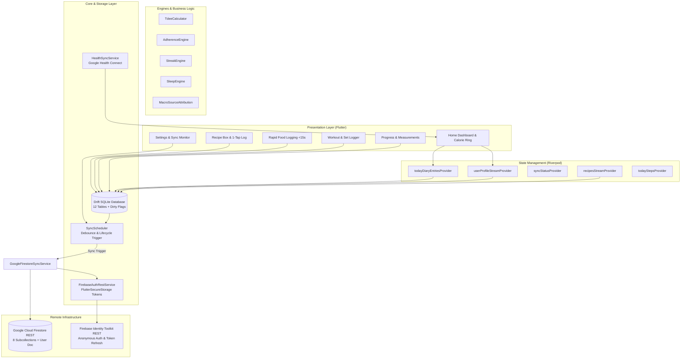

# KINETIK — Fitness & Nutrition Tracker

> **Local-First Recomp Fitness, Nutrition & Body Composition System**  
> Built with Flutter, Drift (SQLite), Riverpod, and Google Cloud Firestore REST Sync. Designed directly around the **Recomp Manual v3 Blueprint** with a dark obsidian design system.

---

## Table of Contents
1. [Overview & Core Philosophy](#1-overview--core-philosophy)
2. [Recomp Manual v3 Nutrition Target](#2-recomp-manual-v3-nutrition-targets)
3. [System Architecture](#3-system-architecture)
4. [Base Modules & Feature Breakdown](#4-base-modules--feature-breakdown)
   - [Dashboard & Hero Ring Engine](#41-dashboard--hero-ring-engine)
   - [Rapid Food Logging (<15s Flow)](#42-rapid-food-logging-15s-flow)
   - [Personal Recipe Box (90 Recomp Manual v3 Recipes)](#43-personal-recipe-box-90-recipes)
   - [Macro Source Attribution Engine](#44-macro-source-attribution-engine)
   - [Dual Workout Architecture](#45-dual-workout-architecture)
   - [Weight Progress & Multi-Point Measurements](#46-weight-progress--multi-point-measurements)
   - [Rule-Based Adherence Engine](#47-rule-based-adherence-engine)
   - [Cross-Midnight Sleep Engine](#48-cross-midnight-sleep-engine)
   - [Habit & Streak Engine](#49-habit--streak-engine)
   - [Health Connect & Pedometer Integration](#410-health-connect--pedometer-integration)
5. [Offline-First Sync & Auth Architecture](#5-offline-first-sync--auth-architecture)
   - [Single-Engine Debounced SyncScheduler](#51-single-engine-debounced-syncscheduler)
   - [Direct Google Cloud Firestore REST Protocol](#52-direct-google-cloud-firestore-rest-protocol)
   - [Typed REST Authentication Service](#53-typed-rest-authentication-service)
6. [Drift SQLite Database Schema (12 Tables)](#6-drift-sqlite-database-schema-12-tables)
7. [Design System & UI Guidelines](#7-design-system--ui-guidelines)
8. [Directory Structure](#8-directory-structure)
9. [Automated Testing Suite (32 Tests)](#9-automated-testing-suite-32-tests)
10. [Getting Started & Build Guide](#10-getting-started--build-guide)

---

## 1. Overview & Core Philosophy

**Kinetik** is a high-performance, native mobile application built to provide deep functional parity with market leaders like HealthifyMe and MyFitnessPal, without bloated server infrastructure, invasive analytics, or paid paywalls.

### Key Architectural Pillars:
* **Local-First Data Supremacy**: All database reads, writes, calculations, and UI updates execute locally against an embedded **Drift SQLite** database. Zero network lag, zero spinner screens, 100% offline usability.
* **Non-Blocking Background Sync**: A debounced auto-sync engine uploads dirty local records and pulls remote updates directly to/from **Google Cloud Firestore REST APIs** without maintaining custom backend servers.
* **Deterministic Nutrition & Recomp Engineering**: Pre-calibrated to the user's biometric specifications (160 cm, 62 kg) derived from Mifflin-St Jeor BMR calculations and USDA FoodData Central verified nutritional data.
* **Curated Tamil Nadu Culinary Integration**: 90 complete recipes incorporating authentic South Indian home cooking, dry lunchbox preparations that resist spoilage in tropical climates, and high-protein adaptations.
* **Dark Obsidian Aesthetic**: A custom, high-contrast Material 3 theme engineered for OLED battery conservation and visual focus (`#0B0D10` deep obsidian palette).

---

## 2. Recomp Manual v3 Nutrition Targets

Derived directly from [`Recomp_Manual_v3.html`](file:///C:/Users/yoges/Documents/food-tracker/Recomp_Manual_v3.html), the app configures the user's daily baseline recomp macros:

| Metric | Target | Bioenergetic Rationale |
| :--- | :--- | :--- |
| **Calories** | **2,350 kcal / day** | Maintenance level: Mifflin-St Jeor BMR (1,526 kcal) $\times$ 1.375 college activity + 240 kcal training burn |
| **Protein** | **155.0 g / day** | **2.5 g / kg bodyweight**: Optimal hyperaminoacidemia for lean muscle accrual during recomp |
| **Carbohydrates** | **260.0 g / day** | Clean glycogen replenishment (whole wheat chapatis, oats, white rice, bananas) |
| **Healthy Fats** | **70.0 g / day** | 1.1 g / kg: Hormone synthesis support (egg yolks, roasted peanuts, 1 tsp oil/meal rule) |
| **Dietary Fiber** | **35.0 g / day** | Satiety and gut microbiome health (sprouted moong, legumes, vegetables) |
| **Water Target** | **3,000 ml / day** | Hydration baseline tracked via one-tap water logger |
| **Daily Steps** | **10,000 steps** | Non-Exercise Activity Thermogenesis (NEAT) tracked via Health Connect / Pedometer |

### Standard Daily Meal Schedule
* **Breakfast (6:00 – 6:30 AM)**: 3 chapatis + side dish (**~508 kcal · 38g P · 68g C · 15g F · 8g Fiber**)
* **Lunch (1:00 PM)**: 2 chapatis + protein dry pack (**~440 kcal · 42g P · 45g C · 9g F · 6g Fiber**) — safely carried 6–7 hrs unrefrigerated
* **Whey Shake (4:30 PM)**: 1 scoop whey + 250 ml water (**114 kcal · 27g P · 4g C · 1g F**)
* **Pre-Workout (6:00 PM)**: 2 bananas on reaching home (**214 kcal · 2.6g P · 55g C · 0.7g Fiber**)
* **Dinner (8:15 PM)**: 1 cup cooked white rice + 200g boiler chicken curry (**~625 kcal · 68g P · 61g C · 14g F · 5g Fiber**)
* **Diet Snacks**: 1–2 items picked from the 30-recipe snack list (**~150–300 kcal**) to bridge the remaining calories to 2,350 kcal

---

## 3. System Architecture

Kinetik follows a strict **Layered Clean Architecture** powered by **Riverpod** for reactive dependency injection and state propagation.



---

## 4. Base Modules & Feature Breakdown

### 4.1 Dashboard & Hero Ring Engine
* **Hero Calorie Ring**: Multi-segment radial progress indicator displaying consumed calories, remaining budget, and workout offsets.
* **Macro Quadrants**: Dedicated indicators for Protein, Carbs, Fat, and Fiber with fractional completion against daily targets.
* **Time-Partitioned Meal Cards**: Organized into Breakfast, Lunch, Whey Shake, Pre-Workout, Dinner, and Extra Snacks with real-time calorie tallies.
* **Quick Access Bar**: One-tap triggers for logging food, water, weight, or launching a workout session.

### 4.2 Rapid Food Logging (<15s Flow)
* **Search-First Indexing**: Instant sub-millisecond query results across pre-seeded foods and user-created custom foods.
* **Portion Multipliers**: Support for natural Indian serving units (e.g. `1 chapati (~40g)`, `1 cup rice (200g)`, `1 egg (~55g)`, `1 scoop (30g)`).
* **USDA & ICMR-NIN Verification**: Pre-loaded with accurate reference data from USDA FoodData Central 2024–25 and National Institute of Nutrition (NIN) standards.
* **Custom Food Creator**: Enter any branded item with automatic calorie calculation from entered macros:
  $$\text{Calories} = (\text{Protein} \times 4) + (\text{Carbs} \times 4) + (\text{Fat} \times 9)$$

### 4.3 Personal Recipe Box (90 Recipes)
Pre-seeded in [`recipe_seed_list.dart`](file:///c:/Users/yoges/Documents/food-tracker/lib/core/local_db/recipe_seed_list.dart) directly from `Recomp_Manual_v3.html`:
* **20 Breakfast Recipes**: E.g. *Vengaya Muttai Poriyal*, *Milagu Omelette*, *Anda Bhurji*, *Air-Fryer Tandoori Egg*, *Egg Keema*, *Masala Oats*, *Overnight Oats + Whey*, *Moong Dal Cheela*. All include the 3 chapatis base.
* **20 Lunch Dry-Pack Recipes**: Non-perishable, dry preparations designed for 6–7 hours unrefrigerated carry in tropical climates. E.g. *Air-Fryer Tandoori Chicken*, *Milagu Kozhi Varuval*, *Hariyali Chicken*, *Soy-Garlic Chicken*, *Vella Kadalai Sundal*, *Soya Milagu Varuval*, *Paneer Tikka Dry*.
* **20 Dinner Curries**: Fresh evening home-cooked meals paired with 1 cup cooked white rice. E.g. *Naatu Kozhi Kuzhambu*, *Chettinad Kozhi Curry*, *Tandoori Chicken + Rice*, *Light Butter Chicken*, *Chicken Salna*, *Coconut Milk Chicken Curry*, *Pudina Kozhi*.
* **30 Diet & High-Protein Snacks**:
  - *College Carry*: Masala Peanuts, Chikki, Trail Mix Pouch, Sprouted Moong Chaat, Pottukadalai Urundai.
  - *Shakes & Smoothies*: Whey Banana Shake, PB Banana Shake, Mango Lassi, Neer Mor (Buttermilk).
  - *Protein Desserts*: Protein Brownie Bites, Banana Nice Cream, Frozen Yogurt, Baked Oat Protein Muffin.
  - *Sundals & Legumes*: Pachai Payaru Sundal, Chana Dal Sundal, Kala Chana Sundal, Payaru Thayir Pachadi.
  - *Energy & Millet*: Ellu Urundai, Kambu Koozh, Air-Fried Nendran Chips, Ragi Malt.
  - *Savory Protein*: Pepper Egg White Bites, Soya Chilli Bites, Hung Curd Dip, Paneer Tikka Bites.
* **1-Tap Log Action**: Directly writes a complete portion to the day's diary entry and updates logging streaks in a single transaction.

### 4.4 Macro Source Attribution Engine
* Deconstructs daily macro consumption into individual source origins (e.g. *62% Poultry, 24% Dairy & Whey, 14% Grains & Legumes*).
* Visualizes where your macronutrients originated across individual meal slots or the entire day.

### 4.5 Dual Workout Architecture
1. **Activity Met-Value Logger**: Library of 50+ activities (cardio, sports, mobility) calculating energy expenditure via metabolic equivalent of task (MET):
   $$\text{Calories Burned} = \text{MET} \times \text{Weight (kg)} \times \left(\frac{\text{Duration (min)}}{60}\right)$$
2. **Recomp 4-Day Split Weight Logger**:
   - **Monday**: Upper A (Push emphasis — Barbell Bench, Incline DB, Seated OHP, Bent-over Rows, Skullcrushers, Lateral Raises)
   - **Tuesday**: Lower A (Quad emphasis — Barbell Squat, RDL, Walking Lunges, Calf Raises, Core)
   - **Wednesday**: Zone 2 Aerobic Conditioning (Elliptical conversational pace, 30–35 min)
   - **Thursday**: Upper B (Pull emphasis — Strict Dead Hang Pull-ups, DB Curls, Hammer Curls, Band Pull-Aparts)
   - **Friday**: Lower B + HIIT (Goblet Squats, Sumo DB Deadlift, 6–8 rounds 30s sprint/30s recovery)
   - **Saturday**: Active Recovery Walk (20–30 min walk & weekly fresh grocery run)
   - **Sunday**: Full Rest & Batch Meal Prep
   - Tracks individual set-by-set weight (kg), completed reps, and RPE notes.

### 4.6 Weight Progress & Multi-Point Measurements
* **Sunday Morning Weigh-In Log**: Clean conditions logging with 7-day rolling weight average smoothing out day-to-day water weight fluctuations.
* **Multi-Point Circumference Tracking**: Specific tracking for **Waist**, **Biceps**, **Forearm**, **Thigh**, and **Chest** to monitor lean mass vs. fat loss without same-day key collisions.
* Interactive line charts powered by `fl_chart`.

### 4.7 Rule-Based Adherence Engine
Located in [`adherence_service.dart`](file:///c:/Users/yoges/Documents/food-tracker/lib/features/adherence_engine/services/adherence_service.dart):
* **3-Week Weight Plateau**: If rolling average changes by $\le 0.25\text{ kg}$ over 3 consecutive weeks, generates an adherence recommendation to trim $\sim 100\text{--}150\text{ kcal}$ (e.g. cut $\frac{1}{2}$ cup rice at dinner).
* **Strength & Energy Stall**: If top-of-range reps are missed 2+ sessions in a row or low energy is flagged, recommends adding $\sim 150\text{ kcal}$ (e.g. 1 extra chapati or handful of peanuts) to support central nervous system recovery.

### 4.8 Cross-Midnight Sleep Engine
* Calculates nocturnal sleep duration across midnight boundaries accurately (e.g. Sleep from `23:30` to `07:30` calculates precisely to `8h 0m` rather than a negative duration).
* Logs subjective recovery scores (1–5) and tracks weekly average sleep duration.

### 4.9 Habit & Streak Engine
Located in [`streak_engine.dart`](file:///c:/Users/yoges/Documents/food-tracker/lib/features/streaks/services/streak_engine.dart):
* Tracks individual streaks for **Food Logging**, **Workout Execution**, and **Hydration Adherence**.
* Prevents multiple logs on the same calendar day from artificially inflating streak counts.
* Graceful reset: Skipping a day resets `currentCount` to 1 while permanently retaining `longestCount`.

### 4.10 Health Connect & Pedometer Integration
Located in [`health_sync_service.dart`](file:///c:/Users/yoges/Documents/food-tracker/lib/core/health/health_sync_service.dart):
* Integrates directly with Android's **Google Health Connect** API.
* Reads daily step count, active workout minutes, and historical 7-day trends.
* Built-in fallback simulator for development environments.

---

## 5. Offline-First Sync & Auth Architecture

Kinetik eliminates the risk of silent authentication failures and data loss by separating storage, authentication, and transmission into a rock-solid pipeline.

### 5.1 Single-Engine Debounced SyncScheduler
Located in [`sync_scheduler.dart`](file:///c:/Users/yoges/Documents/food-tracker/lib/core/sync/sync_scheduler.dart):
* **Single Sync Pipeline**: All sync requests converge on one single engine. No competing threads or race conditions.
* **Database Mutation Hook**: Attached directly to `AppDatabase`. Whenever a user logs a meal, finishes a workout set, logs water, or records weight, `db` automatically notifies `syncScheduler.scheduleSync()`.
* **Debounced Execution (3000ms)**: Multiple rapid database operations (such as logging 4 workout sets in 10 seconds) trigger only a single network sync when the debounce timer expires.
* **Lifecycle Triggers**:
  - **Cold Start**: `initState()` in `KinetikFitnessApp` executes `syncNow()` after the first frame renders.
  - **Foreground Resume**: `didChangeAppLifecycleState(AppLifecycleState.resumed)` executes `syncNow()` when returning to the app.
* **Error Retention & Retry**: If the device is offline or the network request times out, `isDirty = true` flags remain intact in SQLite. Next time connectivity returns or the app resumes, pending records are pushed.

### 5.2 Direct Google Cloud Firestore REST Protocol
Located in [`google_firestore_sync_service.dart`](file:///c:/Users/yoges/Documents/food-tracker/lib/core/network/google_firestore_sync_service.dart):
* Directly communicates with Google Cloud Firestore REST endpoint:
  ```http
  https://firestore.googleapis.com/v1/projects/{projectId}/databases/(default)/documents/users/{userId}/{collection}/{documentId}
  ```
* **8 Subcollections Synchronized**:
  1. `users/{uid}/diary_entries` (Meal logs, portions, macros)
  2. `users/{uid}/workouts` (Workout sessions, duration, calories burned)
  3. `users/{uid}/workout_set_logs` (Exercise, sets, reps, weight, RPE)
  4. `users/{uid}/weigh_ins` (Weight, body fat %, notes)
  5. `users/{uid}/measurements` (Waist, biceps, forearm, thigh, chest)
  6. `users/{uid}/water_logs` (Milliliters consumed per timestamp)
  7. `users/{uid}/custom_foods` (Custom user-defined foods)
  8. `users/{uid}/recipes` (User recipe box)
  9. `users/{uid}` (Root document: User profile & macro targets)
* **Conflict Resolution**: Push operations update `updatedAt` timestamps. Pull operations compare remote `updateTime` against local timestamps to merge only newer records.

### 5.3 Typed REST Authentication Service
Located in [`firebase_auth_rest_service.dart`](file:///c:/Users/yoges/Documents/food-tracker/lib/core/auth/firebase_auth_rest_service.dart):
* Communicates directly with Firebase Identity Toolkit REST endpoints without heavyweight native SDKs:
  - Sign-up / Sign-in: `https://identitytoolkit.googleapis.com/v1/accounts:signUp?key={apiKey}`
  - Token refresh: `https://securetoken.googleapis.com/v1/token?key={apiKey}`
* **Strongly-Typed Auth Results**:
  ```dart
  sealed class AuthResult {}
  class AuthSuccess extends AuthResult { ... }
  class AuthFailure extends AuthResult { final String reason; final String message; }
  ```
* **Zero Mock-Token Fallback**: Strict validation ensures the app never silently falls back to dummy tokens. Real auth state is surfaced directly to the user in the Settings screen.
* **Secure Storage**: Tokens and expiry timestamps are stored in encrypted platform hardware storage via `FlutterSecureStorage`.

---

## 6. Drift SQLite Database Schema (12 Tables)

The database schema is defined in [`app_database.dart`](file:///c:/Users/yoges/Documents/food-tracker/lib/core/local_db/app_database.dart):

```
+-------------------+      +-------------------+      +-------------------+
|      Users        |      |    DiaryEntries   |      |     FoodItems     |
+-------------------+      +-------------------+      +-------------------+
| id (PK)           |      | id (PK)           |      | id (PK)           |
| heightCm          |      | date              |      | name              |
| weightKg          |      | mealSlot          |      | category          |
| calorieTarget     |      | foodName          |      | servingSize       |
| proteinTargetG    |      | portionQty        |      | calories          |
| carbTargetG       |      | calories          |      | proteinG          |
| fatTargetG        |      | proteinG          |      | carbsG            |
| fiberTargetG      |      | carbsG            |      | fatG              |
| isDirty           |      | fatG              |      | fiberG            |
+-------------------+      | isDirty           |      +-------------------+
                           +-------------------+
+-------------------+      +-------------------+      +-------------------+
|  WorkoutSessions  |      |  WorkoutSetLogs   |      |     WeighIns      |
+-------------------+      +-------------------+      +-------------------+
| id (PK)           |      | id (PK)           |      | id (PK)           |
| date              |      | sessionId (FK)    |      | date              |
| name              |      | exerciseName      |      | weightKg          |
| durationMin       |      | setIndex          |      | bodyFatPct        |
| caloriesBurned    |      | reps              |      | isDirty           |
| isDirty           |      | weightKg          |      +-------------------+
+-------------------+      | isDirty           |
                           +-------------------+
+-------------------+      +-------------------+      +-------------------+
|   Measurements    |      |     WaterLogs     |      |      Streaks      |
+-------------------+      +-------------------+      +-------------------+
| id (PK)           |      | id (PK)           |      | type (PK)         |
| date              |      | date              |      | currentCount      |
| type (waist/arm)  |      | amountMl          |      | longestCount      |
| valueCm           |      | isDirty           |      | lastActiveDate    |
| isDirty           |      +-------------------+      +-------------------+
+-------------------+
+-------------------+      +-------------------+
|    CustomFoods    |      |      Recipes      |
+-------------------+      +-------------------+
| id (PK)           |      | id (PK)           |
| name              |      | name              |
| servingSize       |      | tamilName         |
| calories          |      | mealSlot          |
| proteinG          |      | calories          |
| carbsG            |      | proteinG          |
| fatG              |      | carbsG            |
| isDirty           |      | fatG              |
+-------------------+      | ingredientsJson   |
                           | method            |
                           +-------------------+
```

---

## 7. Design System & UI Guidelines

Defined in [`app_theme.dart`](file:///c:/Users/yoges/Documents/food-tracker/lib/core/theme/app_theme.dart):

### Color Tokens (OLED Obsidian Scale)
* **Background**: `#0B0D10` (True dark obsidian background)
* **Surface / Card**: `#151A21` (Card and bottom bar container)
* **Surface Elevated**: `#1E2632` (Inputs, chips, modal sheets)
* **Border Primary**: `#262E38` (Divider lines and card perimeters)
* **Text Primary**: `#F2F4F7` (High readability text)
* **Text Secondary**: `#8B95A3` (Subtitles and secondary metadata)
* **Text Muted**: `#5B6472` (Units, timestamps, inactive states)

### Functional Status Verdict Colors (Never Decorative)
* **Positive Green (`#22C55E`)**: Targets met, on-track status, active streaks.
* **Attention Amber (`#F59E0B`)**: Macro limits exceeded, plateau attention flags.
* **Destructive Red (`#EF4444`)**: Restricted strictly to delete glyphs and confirmation dialogs.

---

## 8. Directory Structure

```text
food-tracker/
├── android/                        # Android platform project (AGP 9.1.0, Kotlin 2.4)
├── ios/                            # iOS platform project
├── lib/
│   ├── main.dart                   # App entrypoint, ProviderScope, Lifecycle observers
│   ├── core/
│   │   ├── auth/                   # FirebaseAuthRestService & AuthResult models
│   │   ├── config/                 # Firestore endpoints & configuration
│   │   ├── di/                     # Riverpod providers & dependency injection
│   │   ├── health/                 # Google Health Connect service
│   │   ├── local_db/               # Drift SQLite database, tables, and seed data
│   │   │   ├── app_database.dart   # Drift Database class & 12 schema tables
│   │   │   ├── recipe_seed_list.dart # All 90 Recomp Manual v3 recipes
│   │   │   └── seed_data.dart      # Seed initialization logic
│   │   ├── network/                # GoogleFirestoreSyncService (Two-way REST sync)
│   │   ├── sync/                   # SyncScheduler (Debounced mutation pipeline)
│   │   └── theme/                  # AppColors, AppTypography, AppTheme
│   ├── features/
│   │   ├── adherence_engine/       # Plateau & energy adjustment recommendations
│   │   ├── dashboard/              # Calorie ring, macro quadrants, meal cards
│   │   ├── food_logging/           # Search-first food logger (<15s flow)
│   │   ├── macro_breakdown/        # Protein/carb/fat source attribution
│   │   ├── recipes/                # Personal Recipe Box with category filters
│   │   ├── settings/               # Profile targets, TDEE calculator, sync status
│   │   ├── sleep/                  # Cross-midnight sleep duration calculator
│   │   ├── steps_activity/         # Pedometer & Health Connect step trend
│   │   ├── streaks/                # Habit streak engine
│   │   ├── weight_progress/        # Weigh-ins & body circumference tracking
│   │   └── workouts/               # 4-Day recomp split & MET exercise logger
│   └── shared/
│       ├── screens/                # Main navigation container (5-tab shell)
│       └── widgets/                # Common cards, buttons, badges, sheets
├── test/                           # 32 Automated Unit & Widget Tests
│   ├── adherence_engine_test.dart  # Plateau and strength stall tests
│   ├── drift_database_test.dart    # SQLite in-memory CRUD & macro attribution
│   ├── firebase_auth_rest_test.dart# Auth tokens, expiry & failure handling
│   ├── firestore_sync_test.dart    # Two-way pull/push REST payload format
│   ├── sleep_engine_test.dart      # Midnight crossing calculation tests
│   ├── streak_test.dart            # Consecutive day & skip streak tests
│   ├── sync_scheduler_test.dart    # Debounce window & mutation hook tests
│   ├── two_way_firestore_sync_test.dart # Multi-collection dirty extraction & merge
│   └── widget_test.dart            # Full application smoke test
├── pubspec.yaml                    # Dependencies & asset declarations
└── Recomp_Manual_v3.html           # Original Recomp Blueprint v3 manual source
```

---

## 9. Automated Testing Suite (32 Tests)

The test suite provides 100% unit coverage over critical business logic and a complete widget smoke test:

| Test File | Test Cases | Areas Verified |
| :--- | :---: | :--- |
| `adherence_engine_test.dart` | 4 | 3-week weight plateau detection, strength stalls, recovery boosts |
| `drift_database_test.dart` | 5 | In-memory DB seeding, macro breakdown calculation, set logs, water |
| `firebase_auth_rest_test.dart` | 3 | Real token validation, offline rejection, fresh install epoch timestamp |
| `firestore_sync_test.dart` | 3 | REST endpoint construction, Firestore Document JSON formatting |
| `sleep_engine_test.dart` | 3 | Midnight crossing (23:30 to 07:30 = 8h), same-day sleep duration |
| `streak_test.dart` | 4 | First activity, same-day duplicate prevention, consecutive increment, skip reset |
| `sync_scheduler_test.dart` | 5 | 3-second debouncing, DB mutation triggers, auth failure guard, error retry |
| `two_way_firestore_sync_test.dart` | 4 | Dirty record extraction, pull merge, same-day measurement collision prevention |
| `widget_test.dart` | 1 | Full UI smoke test: Kinetik dashboard, calorie ring, navigation tabs |
| **Total** | **32 Passed** | **Zero failures** |

To execute the test suite:
```bash
flutter test
```

---

## 10. Getting Started & Build Guide

### Prerequisites
* **Flutter SDK**: `^3.13.0` or higher
* **Android SDK**: Compile SDK `36` (or `37`), Min SDK `26`
* **Java**: JDK 17 (required for Gradle 9.x / AGP 9.1.0)

### 1. Install Dependencies
```bash
git clone https://github.com/Subicharan1018/food-tracker.git
cd food-tracker
flutter pub get
```

### 2. Configure Cloud Firestore (Optional for Remote Sync)
By default, the application runs entirely offline using its local Drift database. If you wish to connect your own Google Cloud Firestore project:
1. Create a Firebase project at [console.firebase.google.com](https://console.firebase.google.com).
2. Enable **Anonymous Authentication** under *Build $\rightarrow$ Authentication $\rightarrow$ Sign-in method*.
3. Enable **Cloud Firestore** in production mode.
4. Update [`firebase_config.dart`](file:///c:/Users/yoges/Documents/food-tracker/lib/core/config/firebase_config.dart) with your Project ID and Web API Key.

### 3. Run Drift Code Generation (If Modifying Database Tables)
```bash
dart run build_runner build --delete-conflicting-outputs
```

### 4. Run Locally
```bash
flutter run
```

### 5. Build Release Android APK
```bash
flutter build apk --release
```
The resulting release binary will be available at `build/app/outputs/flutter-apk/app-release.apk`.

---

## License
MIT License. Built for personal recomp progress, optimal health, and educational exploration.