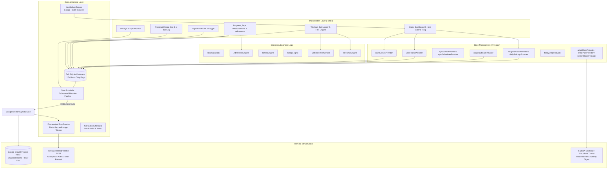

# KINETIK — Fitness, Nutrition & Recomposition System

> **Local-First Recomp Fitness, Nutrition & Body Composition System**  
> Engineered with Flutter, Drift (SQLite), Riverpod, and Google Cloud Firestore REST Sync. Built directly around the **Recomp Manual v3 Blueprint** with a dark obsidian design system.

---

## Table of Contents
1. [Overview & Core Philosophy](#1-overview--core-philosophy)
2. [Recomp Manual v3 Baseline Nutrition Targets](#2-recomp-manual-v3-baseline-nutrition-targets)
3. [System Architecture](#3-system-architecture)
4. [Complete Drift SQLite Database Schema (12 Tables)](#4-complete-drift-sqlite-database-schema-12-tables)
   - [4.1 Database Table Schema & Column Specifications](#41-database-table-schema--column-specifications)
   - [4.2 Dirty Record Lifecycle & Synchronization Hooks](#42-dirty-record-lifecycle--synchronization-hooks)
   - [4.3 Database Helper Methods & Reactive Streams](#43-database-helper-methods--reactive-streams)
   - [4.4 Pre-Seeded Datasets (Foods, Activities, Recipes)](#44-pre-seeded-datasets-foods-activities-recipes)
5. [Design System & Color Tokens](#5-design-system--color-tokens)
   - [5.1 Obsidian Dark Theme Palette (Hex & Semantics)](#51-obsidian-dark-theme-palette-hex--semantics)
   - [5.2 Functional Verdict Colors (Strict Semantic Rules)](#52-functional-verdict-colors-strict-semantic-rules)
   - [5.3 Typography Tokens (AppTypography Scale)](#53-typography-tokens-apptypography-scale)
   - [5.4 Material 3 Theme Component Configurations](#54-material-3-theme-component-configurations)
6. [UI Component Architecture & Screen Placement Hierarchy](#6-ui-component-architecture--screen-placement-hierarchy)
   - [6.1 Global Shell & Navigation (MainNavScreen)](#61-global-shell--navigation-mainnavscreen)
   - [6.2 Tab 1: Home Dashboard (HomeScreen)](#62-tab-1-home-dashboard-homescreen)
   - [6.3 Tab 2: Rapid Food & NLP Logging (LogFoodScreen)](#63-tab-2-rapid-food--nlp-logging-logfoodscreen)
   - [6.4 Tab 3: Workout & Training (WorkoutsScreen)](#64-tab-3-workout--training-workoutsscreen)
   - [6.5 Tab 4: Weight Progress & Measurements (WeightProgressScreen)](#65-tab-4-weight-progress--measurements-weightprogressscreen)
   - [6.6 Tab 5: More Tools & Sub-Screens](#66-tab-5-more-tools--sub-screens)
     - [Macro Source Attribution (MacroSourceScreen)](#macro-source-attribution-macrosourcescreen)
     - [Daily Steps & 7-Day Trend (StepsScreen)](#daily-steps--7-day-trend-stepsscreen)
     - [Cross-Midnight Sleep Engine (SleepScreen)](#cross-midnight-sleep-engine-sleepscreen)
     - [Personal Recipe Box (RecipesScreen)](#personal-recipe-box-recipesscreen)
     - [Settings & Cloud Sync Monitor (SettingsScreen)](#settings--cloud-sync-monitor-settingsscreen)
   - [6.7 AI-Assisted Card Components](#67-ai-assisted-card-components)
7. [Offline-First Sync & Auth Architecture](#7-offline-first-sync--auth-architecture)
   - [7.1 Debounced SyncScheduler (3000ms Window)](#71-debounced-syncscheduler-3000ms-window)
   - [7.2 Google Cloud Firestore Two-Way REST Protocol](#72-google-cloud-firestore-two-way-rest-protocol)
   - [7.3 Typed REST Authentication Service](#73-typed-rest-authentication-service)
8. [Directory Structure](#8-directory-structure)
9. [Automated Testing Suite (51 Tests Across 17 Files)](#9-automated-testing-suite-51-tests-across-17-files)
10. [Getting Started & Build Guide](#10-getting-started--build-guide)

---

## 1. Overview & Core Philosophy

**Kinetik** is a high-performance native mobile application providing deep functional parity with enterprise fitness platforms without bloated server infrastructure, invasive analytics, or paid paywalls.

### Key Architectural Pillars:
* **Local-First Data Supremacy**: All database mutations, queries, calculations, and UI states operate against an embedded **Drift SQLite** database. Zero network lag, zero spinner screens, 100% offline usability.
* **Non-Blocking Background Sync**: A debounced auto-sync engine uploads dirty local records and pulls remote updates directly to/from **Google Cloud Firestore REST APIs** without maintaining custom backend servers.
* **Deterministic Nutrition & Recomp Engineering**: Pre-calibrated to biometric specifications (160 cm, 62 kg) derived from Mifflin-St Jeor BMR calculations and USDA FoodData Central / ICMR-NIN verified nutritional data.
* **Curated Tamil Nadu Culinary Integration**: 90 complete recipes incorporating authentic South Indian home cooking, dry lunchbox preparations that resist spoilage in tropical climates, and high-protein adaptations.
* **Dark Obsidian Aesthetic**: A custom, high-contrast Material 3 theme engineered for OLED battery conservation and visual focus (`#0B0D10` deep obsidian palette).

---

## 2. Recomp Manual v3 Baseline Nutrition Targets

Derived directly from [`Recomp_Manual_v3.html`](file:///c:/Users/yoges/Documents/food-tracker/Recomp_Manual_v3.html), the app pre-configures the baseline daily recomp targets:

| Metric | Target | Bioenergetic Rationale |
| :--- | :--- | :--- |
| **Calories** | **2,350 kcal / day** | Maintenance level: Mifflin-St Jeor BMR (1,526 kcal) $\times$ 1.375 college activity + 240 kcal training burn |
| **Protein** | **155.0 g / day** | **2.5 g / kg bodyweight**: Optimal hyperaminoacidemia for lean muscle accrual during recomp |
| **Carbohydrates** | **260.0 g / day** | Clean glycogen replenishment (whole wheat chapatis, oats, white rice, bananas) |
| **Healthy Fats** | **70.0 g / day** | 1.1 g / kg: Hormone synthesis support (egg yolks, roasted peanuts, 1 tsp oil/meal rule) |
| **Dietary Fiber** | **35.0 g / day** | Satiety and gut microbiome health (sprouted moong, legumes, vegetables) |
| **Water Target** | **3,000 ml / day** | Hydration baseline tracked via one-tap water logger |
| **Daily Steps** | **10,000 steps** | Non-Exercise Activity Thermogenesis (NEAT) tracked via Health Connect / Pedometer |

### Standard Daily Meal Schedule
* **Breakfast (6:00 – 6:30 AM)**: 3 chapatis + side dish (**~508 kcal · 38g P · 68g C · 15g F · 8g Fiber**)
* **Lunch (1:00 PM)**: 2 chapatis + protein dry pack (**~440 kcal · 42g P · 45g C · 9g F · 6g Fiber**) — safely carried 6–7 hrs unrefrigerated
* **Whey Shake (4:30 PM)**: 1 scoop whey + 250 ml water (**114 kcal · 27g P · 4g C · 1g F**)
* **Pre-Workout (6:00 PM)**: 2 bananas on reaching home (**214 kcal · 2.6g P · 55g C · 0.7g Fiber**)
* **Dinner (8:15 PM)**: 1 cup cooked white rice + 200g boiler chicken curry (**~625 kcal · 68g P · 61g C · 14g F · 5g Fiber**)
* **Diet Snacks**: 1–2 items picked from the 30-recipe snack list (**~150–300 kcal**) to bridge remaining calories to 2,350 kcal

---

## 3. System Architecture

Kinetik follows a strict **Layered Clean Architecture** powered by **Riverpod** for reactive dependency injection, state management, and stream propagation.



---

## 4. Complete Drift SQLite Database Schema (12 Tables)

The database schema is defined in [`app_database.dart`](file:///c:/Users/yoges/Documents/food-tracker/lib/core/local_db/app_database.dart).

```
+-------------------+      +-------------------+      +-------------------+
|      Users        |      |    DiaryEntries   |      |     FoodItems     |
+-------------------+      +-------------------+      +-------------------+
| id (PK, Text)     |      | id (PK, Text)     |      | id (PK, Text)     |
| heightCm (Real)   |      | date (Text)       |      | name (Text)       |
| weightKg (Real)   |      | mealSlot (Text)   |      | brand (Text, Null)|
| age (Int)         |      | foodItemId (Text) |      | category (Text)   |
| activityLevel(Txt)|      | customFoodId(Txt) |      | servingSize (Real)|
| calorieTarget(Int)|      | foodName (Text)   |      | servingUnit (Text)|
| proteinTargetG(R) |      | portionQty (Real) |      | calories (Real)   |
| carbTargetG (R)   |      | portionUnit (Text)|      | proteinG (Real)   |
| fatTargetG (R)    |      | calories (Real)   |      | carbsG (Real)     |
| fiberTargetG (R)  |      | proteinG (Real)   |      | fatG (Real)       |
| waterTargetMl(Int)|      | carbsG (Real)     |      | fiberG (Real)     |
| stepsTarget (Int) |      | fatG (Real)       |      | source (Text)     |
| updatedAt (Date)  |      | fiberG (Real)     |      | isGeneric (Bool)  |
+-------------------+      | loggedAt (Date)   |      | updatedAt (Date)  |
                           | isDirty (Bool)    |      +-------------------+
                           | updatedAt (Date)  |
                           +-------------------+
+-------------------+      +-------------------+      +-------------------+
|  WorkoutSessions  |      |  WorkoutSetLogs   |      |     WeighIns      |
+-------------------+      +-------------------+      +-------------------+
| id (PK, Text)     |      | id (PK, Text)     |      | id (PK, Text)     |
| date (Text)       |      | sessionId (Text)  |      | date (Text)       |
| activityId (Text) |      | date (Text)       |      | weightKg (Real)   |
| activityName (Txt)|      | exerciseName(Txt) |      | rollingAvgKg(Real)|
| durationMin (Int) |      | setIndex (Int)    |      | notes (Text, Null)|
| intensity (Text)  |      | weightKg (Real)   |      | loggedAt (Date)   |
| caloriesBurned(R) |      | reps (Int)        |      | isDirty (Bool)    |
| source (Text)     |      | targetReps (Text) |      | updatedAt (Date)  |
| notes (Text, Null)|      | notes (Text, Null)|      +-------------------+
| loggedAt (Date)   |      | completed (Bool)  |
| isDirty (Bool)    |      | loggedAt (Date)   |
| updatedAt (Date)  |      | isDirty (Bool)    |
+-------------------+      +-------------------+
+-------------------+      +-------------------+      +-------------------+
|   Measurements    |      |     WaterLogs     |      |      Streaks      |
+-------------------+      +-------------------+      +-------------------+
| id (PK, Text)     |      | id (PK, Text)     |      | type (PK, Text)   |
| date (Text)       |      | date (Text)       |      | currentCount (Int)|
| type (Text)       |      | mlAdded (Int)     |      | longestCount (Int)|
| valueCm (Real)    |      | loggedAt (Date)   |      | lastActiveDate(Tx)|
| loggedAt (Date)   |      | isDirty (Bool)    |      | updatedAt (Date)  |
| isDirty (Bool)    |      +-------------------+      +-------------------+
| updatedAt (Date)  |
+-------------------+
+-------------------+      +-------------------+      +-------------------+
|    CustomFoods    |      |      Recipes      |      |    Activities     |
+-------------------+      +-------------------+      +-------------------+
| id (PK, Text)     |      | id (PK, Text)     |      | id (PK, Text)     |
| name (Text)       |      | name (Text)       |      | name (Text)       |
| servingSize (Real)|      | tamilName (Text)  |      | category (Text)   |
| servingUnit (Text)|      | mealSlot (Text)   |      | metValue (Real)   |
| calories (Real)   |      | dayOfWeek (Text)  |      | defaultDuration(I)|
| proteinG (Real)   |      | calories (Real)   |      | description (Txt) |
| carbsG (Real)     |      | proteinG (Real)   |      +-------------------+
| fatG (Real)       |      | carbsG (Real)     |
| fiberG (Real)     |      | fatG (Real)       |
| notes (Text, Null)|      | fiberG (Real)     |
| createdAt (Date)  |      | ingredientsJson   |
| updatedAt (Date)  |      | method (Text)     |
| isDirty (Bool)    |      | shelfLifeTip(Txt) |
+-------------------+      | tags (Text, Null) |
                           | updatedAt (Date)  |
                           +-------------------+
```

### 4.1 Database Table Schema & Column Specifications

#### 1. `Users` Table (Singleton Profile)
* `id` (`TextColumn`, PK): User identity key (`default_user`).
* `heightCm` (`RealColumn`, default: `160.0`): User height in centimeters.
* `weightKg` (`RealColumn`, default: `62.0`): Baseline body mass in kilograms.
* `age` (`IntColumn`, default: `21`): User age in years.
* `activityLevel` (`TextColumn`, default: `'moderate'`): Activity tier multiplier.
* `calorieTarget` (`IntColumn`, default: `2350`): Baseline daily caloric energy target in kcal.
* `proteinTargetG` (`RealColumn`, default: `155.0`): Daily protein macro target (2.5 g/kg).
* `carbTargetG` (`RealColumn`, default: `260.0`): Daily carbohydrate macro target (4.2 g/kg).
* `fatTargetG` (`RealColumn`, default: `70.0`): Daily fat macro target (1.1 g/kg).
* `fiberTargetG` (`RealColumn`, default: `30.0` / seed: `35.0`): Daily dietary fiber target in grams.
* `waterTargetMl` (`IntColumn`, default: `3000`): Hydration target in milliliters.
* `stepsTarget` (`IntColumn`, default: `10000`): Daily step milestone.
* `updatedAt` (`DateTimeColumn`, default: `currentDateAndTime`): Local mutation timestamp.

#### 2. `FoodItems` Table (Reference Food Database)
* `id` (`TextColumn`, PK): Unique food identifier (e.g. `whole_egg_raw`, `boiler_chicken_breast_cooked`).
* `name` (`TextColumn`): Full descriptor with standard portion annotation.
* `brand` (`TextColumn`, nullable): Commercial brand or source indicator.
* `category` (`TextColumn`, default: `'generic'`): Category tag (`protein`, `grain`, `legume`, `dairy`, `fruit`, `oil`).
* `servingSize` (`RealColumn`, default: `100.0`): Quantitative unit reference base.
* `servingUnit` (`TextColumn`, default: `'g'`): Unit of measurement (`g`, `egg (~55g)`, `white (~30g)`, `chapati (~40g)`).
* `calories` (`RealColumn`): Energy content per serving in kcal.
* `proteinG` (`RealColumn`): Protein content per serving in grams.
* `carbsG` (`RealColumn`): Carbohydrate content per serving in grams.
* `fatG` (`RealColumn`): Lipid content per serving in grams.
* `fiberG` (`RealColumn`, default: `0.0`): Dietary fiber content per serving in grams.
* `source` (`TextColumn`, default: `'icmr_nin'`): Data provenance (`usda_fdc`, `icmr_nin`, `curated_tn`).
* `isGeneric` (`BoolColumn`, default: `true`): True if whole whole-food/generic staple.
* `updatedAt` (`DateTimeColumn`, default: `currentDateAndTime`): Update timestamp.

#### 3. `CustomFoods` Table (User-Defined Custom Library)
* `id` (`TextColumn`, PK): UUID string.
* `name` (`TextColumn`): Custom item name entered by user.
* `servingSize` (`RealColumn`, default: `100.0`): Serving quantity.
* `servingUnit` (`TextColumn`, default: `'g'`): Serving measurement unit.
* `calories` (`RealColumn`): Calories per serving in kcal.
* `proteinG` (`RealColumn`): Protein in grams.
* `carbsG` (`RealColumn`): Carbs in grams.
* `fatG` (`RealColumn`): Fat in grams.
* `fiberG` (`RealColumn`, default: `0.0`): Fiber in grams.
* `notes` (`TextColumn`, nullable): Custom prep notes or brand information.
* `createdAt` (`DateTimeColumn`, default: `currentDateAndTime`): Creation timestamp.
* `updatedAt` (`DateTimeColumn`, default: `currentDateAndTime`): Modification timestamp.
* `isDirty` (`BoolColumn`, default: `true`): Cloud synchronization dirty flag.

#### 4. `DiaryEntries` Table (Daily Food Journal)
* `id` (`TextColumn`, PK): UUID string.
* `date` (`TextColumn`): Calendar day in `YYYY-MM-DD` ISO format.
* `mealSlot` (`TextColumn`): Assigned meal partition (`breakfast`, `lunch`, `shake`, `pre_workout`, `dinner`, `snack`).
* `foodItemId` (`TextColumn`, nullable): Foreign key reference to `FoodItems.id`.
* `customFoodId` (`TextColumn`, nullable): Foreign key reference to `CustomFoods.id`.
* `foodName` (`TextColumn`): Display name of consumed item.
* `portionQty` (`RealColumn`): Portion multiplier (e.g. `1.0`, `1.5`, `2.0`).
* `portionUnit` (`TextColumn`): Measurement unit descriptor.
* `calories` (`RealColumn`): Scaled caloric energy ($\text{calories} \times \text{portionQty}$).
* `proteinG` (`RealColumn`): Scaled protein in grams.
* `carbsG` (`RealColumn`): Scaled carbohydrates in grams.
* `fatG` (`RealColumn`): Scaled fats in grams.
* `fiberG` (`RealColumn`, default: `0.0`): Scaled fiber in grams.
* `loggedAt` (`DateTimeColumn`, default: `currentDateAndTime`): Exact timestamp of insertion.
* `isDirty` (`BoolColumn`, default: `true`): Cloud synchronization flag.
* `updatedAt` (`DateTimeColumn`, default: `currentDateAndTime`): Record timestamp.

#### 5. `Activities` Table (MET Activity Library)
* `id` (`TextColumn`, PK): Unique activity identifier (e.g. `running_6mph`, `elliptical_moderate`).
* `name` (`TextColumn`): Descriptive activity title.
* `category` (`TextColumn`, default: `'cardio'`): Category (`cardio`, `sports`, `strength`, `mobility`).
* `metValue` (`RealColumn`): Metabolic Equivalent of Task coefficient.
* `defaultDurationMin` (`IntColumn`, default: `30`): Default duration in minutes.
* `description` (`TextColumn`, nullable): Intensity and setup guidance.

#### 6. `WorkoutSessions` Table (Cardio & Routine Sessions)
* `id` (`TextColumn`, PK): UUID string.
* `date` (`TextColumn`): Date string in `YYYY-MM-DD` format.
* `activityId` (`TextColumn`, nullable): Foreign key reference to `Activities.id`.
* `activityName` (`TextColumn`): Title of workout or cardio activity.
* `durationMin` (`IntColumn`): Workout duration in minutes.
* `intensity` (`TextColumn`, default: `'moderate'`): Intensity multiplier (`light` [0.85x], `moderate` [1.0x], `vigorous` [1.25x]).
* `caloriesBurned` (`RealColumn`): Computed energy expenditure via MET formula.
* `source` (`TextColumn`, default: `'manual'`): Source tag (`manual`, `routine`, `health_connect`).
* `notes` (`TextColumn`, nullable): Session notes.
* `loggedAt` (`DateTimeColumn`, default: `currentDateAndTime`): Logging timestamp.
* `isDirty` (`BoolColumn`, default: `true`): Cloud synchronization flag.
* `updatedAt` (`DateTimeColumn`, default: `currentDateAndTime`): Modification timestamp.

#### 7. `WorkoutSetLogs` Table (Strength Training Sets)
* `id` (`TextColumn`, PK): UUID string.
* `sessionId` (`TextColumn`): Routine session tag (e.g. `recomp_Mon`, `recomp_Tue`).
* `date` (`TextColumn`): Date in `YYYY-MM-DD` format.
* `exerciseName` (`TextColumn`): Specific exercise (e.g. `Barbell bench press`, `Pull-ups`, `Barbell back squat`).
* `setIndex` (`IntColumn`): Set order number (1-indexed).
* `weightKg` (`RealColumn`): Resistance load in kilograms.
* `reps` (`IntColumn`): Repetitions completed.
* `targetReps` (`TextColumn`, nullable): Protocol target rep bracket (e.g. `4 × 8–10`).
* `notes` (`TextColumn`, nullable): Form or RPE notes.
* `completed` (`BoolColumn`, default: `true`): Completion status check.
* `loggedAt` (`DateTimeColumn`, default: `currentDateAndTime`): Logging timestamp.
* `isDirty` (`BoolColumn`, default: `true`): Cloud synchronization flag.

#### 8. `WeighIns` Table (Bodyweight Tracking)
* `id` (`TextColumn`, PK): UUID string.
* `date` (`TextColumn`): Date in `YYYY-MM-DD` format.
* `weightKg` (`RealColumn`): Measured bodyweight in kilograms.
* `rollingAvgKg` (`RealColumn`, nullable): Computed 7-day rolling average to eliminate water noise.
* `notes` (`TextColumn`, nullable): Fasted state, sodium intake notes.
* `loggedAt` (`DateTimeColumn`, default: `currentDateAndTime`): Weigh-in timestamp.
* `isDirty` (`BoolColumn`, default: `true`): Cloud synchronization flag.
* `updatedAt` (`DateTimeColumn`, default: `currentDateAndTime`): Record timestamp.

#### 9. `Measurements` Table (Circumference Tracking)
* `id` (`TextColumn`, PK): UUID string.
* `date` (`TextColumn`): Date in `YYYY-MM-DD` format.
* `type` (`TextColumn`): Measurement site (`waist`, `biceps`, `forearm`, `chest`, `thigh`).
* `valueCm` (`RealColumn`): Circumference value in centimeters.
* `loggedAt` (`DateTimeColumn`, default: `currentDateAndTime`): Logging timestamp.
* `isDirty` (`BoolColumn`, default: `true`): Cloud synchronization flag.
* `updatedAt` (`DateTimeColumn`, default: `currentDateAndTime`): Record timestamp.

#### 10. `WaterLogs` Table (Hydration Journal)
* `id` (`TextColumn`, PK): UUID string.
* `date` (`TextColumn`): Date in `YYYY-MM-DD` format.
* `mlAdded` (`IntColumn`): Volume of water consumed in milliliters (e.g. 250, 500).
* `loggedAt` (`DateTimeColumn`, default: `currentDateAndTime`): Insertion timestamp.
* `isDirty` (`BoolColumn`, default: `true`): Cloud synchronization flag.

#### 11. `Streaks` Table (Habit Continuity)
* `type` (`TextColumn`, PK): Habit category (`logging`, `workout`).
* `currentCount` (`IntColumn`, default: `0`): Active consecutive day counter.
* `longestCount` (`IntColumn`, default: `0`): All-time peak streak count.
* `lastActiveDate` (`TextColumn`, nullable): Date of most recent activity in `YYYY-MM-DD` format.
* `updatedAt` (`DateTimeColumn`, default: `currentDateAndTime`): Last update timestamp.

#### 12. `Recipes` Table (Tamil Nadu Recomp Culinary Database)
* `id` (`TextColumn`, PK): Unique recipe key.
* `name` (`TextColumn`): Primary English recipe name.
* `tamilName` (`TextColumn`, nullable): Authentic Tamil script/transliteration name.
* `mealSlot` (`TextColumn`): Categorized meal slot (`breakfast`, `lunch`, `dinner`, `snack`).
* `dayOfWeek` (`TextColumn`, nullable): Recommended rotation day (`Mon`, `Tue`, etc.).
* `calories` (`RealColumn`): Total calories per full prepared serving.
* `proteinG` (`RealColumn`): Total protein in grams.
* `carbsG` (`RealColumn`): Total carbohydrates in grams.
* `fatG` (`RealColumn`): Total fats in grams.
* `fiberG` (`RealColumn`, default: `0.0`): Total dietary fiber in grams.
* `ingredientsJson` (`TextColumn`): JSON-encoded list of ingredients and quantities.
* `method` (`TextColumn`): Step-by-step cooking and preparation directions.
* `shelfLifeTip` (`TextColumn`, nullable): Food safety and storage guidance for tropical climates.
* `tags` (`TextColumn`, nullable): Comma-separated search tags (e.g. `air_fryer`, `dry_pack`, `high_protein`).
* `updatedAt` (`DateTimeColumn`, default: `currentDateAndTime`): Record timestamp.

---

### 4.2 Dirty Record Lifecycle & Synchronization Hooks

Every table storing user mutations contains an `isDirty` boolean flag defaulting to `true`:
1. **Local Mutation**: When an entity is inserted or updated locally, `isDirty = true` is set.
2. **Scheduler Notification**: `AppDatabase` automatically calls `syncScheduler?.scheduleSync()`.
3. **Extraction & Push**: During the background sync phase, `AppDatabase` extracts all dirty records via typed extractors:
   - `getDirtyDiaryEntries()`, `getDirtyWorkoutSessions()`, `getDirtyWorkoutSetLogs()`
   - `getDirtyWeighIns()`, `getDirtyMeasurements()`, `getDirtyWaterLogs()`, `getDirtyCustomFoods()`
4. **Cloud Confirmation & Clean Mark**: Upon receiving HTTP 200 responses from Google Cloud Firestore, `mark[Entity]Clean(ids)` is executed to set `isDirty = false`.

---

### 4.3 Database Helper Methods & Reactive Streams

`AppDatabase` exposes strongly typed reactive streams and helper queries:
* `watchEntriesForDate(String dateStr)` $\rightarrow$ `Stream<List<DiaryEntry>>`
* `watchWaterForDate(String dateStr)` $\rightarrow$ `Stream<int>` (computes live sum of `mlAdded`)
* `watchWorkoutsForDate(String dateStr)` $\rightarrow$ `Stream<List<WorkoutSession>>`
* `watchSetLogsForDate(String dateStr)` $\rightarrow$ `Stream<List<WorkoutSetLog>>`
* `watchWeighIns(int limit)` $\rightarrow$ `Stream<List<WeighIn>>`
* `watchMeasurements(String type)` $\rightarrow$ `Stream<List<Measurement>>`
* `watchRecipes()` $\rightarrow$ `Stream<List<Recipe>>`
* `searchFoodItems(String query)` $\rightarrow$ Sub-millisecond case-insensitive prefix/infix SQLite search.
* `searchActivities(String query)` $\rightarrow$ Sub-millisecond MET activity lookup.
* `getRecentFoodNames(int limit)` $\rightarrow$ Extracts distinct recently logged food items.
* `upsert[Entity]Batch(List<Companion> items)` $\rightarrow$ High-throughput batch upserts for pull sync.

---

### 4.4 Pre-Seeded Datasets (Foods, Activities, Recipes)

* **Food Database (`seed_data.dart`)**: Pre-seeded with verified macros from USDA FoodData Central 2024–25 and National Institute of Nutrition (ICMR-NIN) standards.
* **Activity Database (`seed_data.dart`)**: 50+ MET activities spanning running, cycling, swimming, elliptical, brisk walking, bodyweight calisthenics, and sports.
* **Personal Recipe Box (`recipe_seed_list.dart`)**: All **90 Recomp Manual v3 Recipes** categorized into:
  - 20 High-Protein Breakfasts (Omelettes, Anda Bhurji, Cheela, Masala Oats)
  - 20 Packed Lunch Dry-Packs (Non-perishable, 6–7 hr carry safe)
  - 20 Evening Chicken Curries & Gravies
  - 30 Diet, Millet, Sundal & High-Protein Snacks

---

## 5. Design System & Color Tokens

Defined in [`app_theme.dart`](file:///c:/Users/yoges/Documents/food-tracker/lib/core/theme/app_theme.dart), Kinetik follows an OLED Obsidian Minimalist Aesthetic.

### 5.1 Obsidian Dark Theme Palette (Hex & Semantics)

| Color Token | Hex Value | Semantic Usage in UI |
| :--- | :--- | :--- |
| `AppColors.background` | `#0B0D10` | 95% OLED Black base; scaffold background, zero battery drain |
| `AppColors.surface` | `#151A21` | Surface containers, bottom navigation bar, search filled inputs |
| `AppColors.card` | `#151A21` | Primary card background for dashboard cards, list tiles, dialogs |
| `AppColors.surfaceElevated` | `#1E2632` | Elevated surfaces, choice chips, icon containers, bottom sheets |
| `AppColors.cardElevated` | `#1E2632` | Calorie ring track, progress bar backgrounds, secondary badges |
| `AppColors.border` | `#262E38` | Card perimeters, input field outlines, chip borders |
| `AppColors.borderSubtle` | `#1E2632` | List item dividers, internal card partition lines |
| `AppColors.textPrimary` | `#F2F4F7` | Display titles, numerical stats, primary action buttons |
| `AppColors.textSecondary` | `#8B95A3` | Subtitles, secondary metadata, unit labels, inactive tab icons |
| `AppColors.textMuted` | `#5B6472` | Disabled labels, timestamps, measurement units, captions |
| `AppColors.textInverse` | `#0B0D10` | Text on filled buttons (`#F2F4F7`) and active chip fills |

---

### 5.2 Functional Verdict Colors (Strict Semantic Rules)

Verdict colors represent real data outcomes and are never used decoratively:

* **Positive Emerald Green (`#22C55E`)**:
  - Nutrition target reached (e.g. Protein goal met or exceeded, calories within 95–105% buffer window).
  - Active habit streaks.
  - Health Connect successful sync indicator.
  - AI "Plan my evening" primary action button.
  - HIIT Completed state.
* **Attention Amber (`#F59E0B`)**:
  - Calorie or macro limit exceeded (>105% of target budget).
  - 3-week weight plateau alert ($ \le 0.25\text{ kg}$ delta).
  - Active workout rest countdown timer.
  - Burned workout calories offset callout.
* **Destructive Coral Red (`#EF4444`)**:
  - Restricted strictly to delete glyphs, entry deletion dialogs, and error alerts.
  - HIIT Sprint interval phase accent.
* **HIIT Recovery Teal (`#14B8A6`)**:
  - HIIT Recovery interval phase accent.

---

### 5.3 Typography Tokens (AppTypography Scale)

| Token Name | Size | Weight | Letter Spacing | Color | Primary Usage |
| :--- | :---: | :---: | :---: | :--- | :--- |
| `AppTypography.displayLarge` | `32px` | `w700` | `-0.8` | `#F2F4F7` | Hero statistics, sleep duration, weigh-in dial |
| `AppTypography.displayMedium` | `26px` | `w700` | `-0.5` | `#F2F4F7` | Banner numerical totals |
| `AppTypography.titleLarge` | `20px` | `w600` | Normal | `#F2F4F7` | App bar headers, bottom sheet titles |
| `AppTypography.titleMedium` | `16px` | `w600` | Normal | `#F2F4F7` | Card titles, section headers |
| `AppTypography.bodyLarge` | `15px` | `w400` | Normal | `#F2F4F7` | Primary item text, food names |
| `AppTypography.bodyMedium` | `14px` | `w400` | Normal | `#8B95A3` | Subtitles, recipe descriptions |
| `AppTypography.labelSmall` | `12px` | `w500` | Normal | `#5B6472` | Macro units, timestamps, status tags |
| `AppTypography.statNum` | `22px` | `w800` | `-0.5` | `#F2F4F7` | Macro card numerical values |

---

### 5.4 Material 3 Theme Component Configurations

* **CardTheme**: 0 elevation, 16px circular border radius, 1px solid border (`#262E38`), `#151A21` background fill.
* **ElevatedButtonTheme**: `#F2F4F7` background, `#0B0D10` foreground, 12px circular radius, `w700` font weight.
* **FloatingActionButtonTheme**: `#F2F4F7` background, `#0B0D10` foreground, 2 elevation.
* **BottomNavigationBarTheme**: `#151A21` background, `#F2F4F7` selected item, `#8B95A3` unselected item, 0 elevation.
* **InputDecorationTheme**: Filled `#151A21`, 12px radius, `#262E38` border, `#F2F4F7` (1.5px) focused border.
* **SwitchTheme & CheckboxTheme**: Custom dark obsidian styling with `#F2F4F7` check marks and `#1E2632` tracks.

---

## 6. UI Component Architecture & Screen Placement Hierarchy

```
App Navigation Shell (MainNavScreen)
 ├── Tab 1: Home Dashboard (HomeScreen)
 │    ├── Top App Bar (Logo, Recomp Badge, Date Selector, Macro Breakdown Icon)
 │    ├── Hero Calorie Ring (CalorieRing, Workout Offset Banner)
 │    ├── Macro Quadrant Grid (MacroBarsGrid -> 4x _MacroCard)
 │    ├── Macro Source Attribution Shortcut
 │    ├── Streaks Card (StreaksCard -> 2x _StreakTile)
 │    ├── Water Tracking Card (WaterTrackingCard -> 2x _QuickWaterButton)
 │    ├── Steps Card (StepsCard -> Progress Indicator & Simulation)
 │    ├── Meal Schedule & Partition Cards (6x MealSlotCard -> Itemized Food Rows)
 │    ├── AI Action Trigger ("Plan my evening" -> MealPlanCard Bottom Sheet)
 │    ├── AI Weekly Digest Card (WeeklyDigestCard - Sunday/Monday)
 │    └── AI Workout Progression Card (WorkoutProgressionCard - Weekend)
 │
 ├── Tab 2: Log Food (LogFoodScreen)
 │    ├── Top App Bar ("Log Food", Manual Entry Action)
 │    ├── Meal Slot Filter Chips (6x _SlotChip)
 │    ├── Search Bar / NLP Toggle Input (NlpInputWidget)
 │    ├── Recent Foods Action Chips (Top 10)
 │    ├── Food Search Results ListView
 │    ├── Portion Modal Bottom Sheet (_showPortionDialog -> Live Macro Preview, Presets, Stepper)
 │    └── Custom Food Creation Dialog (_showManualEntryDialog)
 │
 ├── Tab 3: Workout & Training (WorkoutsScreen)
 │    ├── Sliver App Bar (Workout Title, Date Picker)
 │    ├── Calorie Burn Banner (Daily Burn Target vs Burned)
 │    ├── Health Connect Sync Status Card
 │    ├── My Workout Routine Horizontal Carousel
 │    └── Persistent TabBar:
 │         ├── Tab 1: Recomp Split (_RecompSplitTab)
 │         │    ├── Set Rest Timer Banner (SetRestTimerWidget -> Audio Ding, +30/-15s, Slider)
 │         │    ├── 5x Expandable Day Cards (Push, Pull, Zone 2, Legs, Core+HIIT)
 │         │    │    ├── Exercise Item Rows (Sets x Reps, Setup Notes)
 │         │    │    ├── Set Logger Modal Sheet (_showQuickSetLogger -> Kg/Rep Steppers)
 │         │    │    └── Launch HIIT Sprint Timer Button (HiitTimerScreen)
 │         └── Tab 2: Activity History (_WorkoutHistoryTab -> Chronological Workout Logs)
 │
 ├── Tab 4: Weight Progress (WeightProgressScreen)
 │    ├── Goal Card (Target Weight, Delta, Weeks Remaining, Edit Dialog)
 │    ├── 7-Day Rolling Trend Line Chart (fl_chart Spline Curve)
 │    ├── Rule-Based Adherence Recommendation Card (Plateau Trim / Energy Boost)
 │    ├── Progress Gallery Card (Photo Attachment Callout)
 │    ├── Timeline Weigh-in History List
 │    ├── Weigh-In Modal Bottom Sheet (_showWeighInDialog -> 48px Numeric Stepper)
 │    └── Tape Measurement Sheet (_showMeasurementDialog -> Waist, Arms, Chest, Thigh)
 │
 └── Tab 5: More Tools (MoreMenuScreen)
      ├── Macro Source Breakdown (MacroSourceScreen -> 3 Tabs, Meal Filters, Attribution)
      ├── Daily Steps & 7-Day Trend (StepsScreen -> 7-Day Bar Chart, Health Connect Link)
      ├── Cross-Midnight Sleep Engine (SleepScreen -> Sleep/Wake Time Pickers, Duration Hero)
      ├── Personal Recipe Box (RecipesScreen -> 90 Recipes, Meal Filters, Detail Sheet, 1-Tap Log)
      └── Settings & Profile (SettingsScreen -> Target Editors, Gym Setup, Firestore Sync Monitor)
```

---

### 6.1 Global Shell & Navigation (`MainNavScreen`)

Located in [`main_nav_screen.dart`](file:///c:/Users/yoges/Documents/food-tracker/lib/shared/screens/main_nav_screen.dart):
* **State Management**: `StatefulWidget` managing active tab index `_currentIndex`.
* **Body**: `IndexedStack` preserving all 5 tab states across navigation switches.
* **Bottom Navigation Bar**: Custom `NavigationBar` with `#151A21` background, top border (`#262E38`), and semi-transparent selection indicator:
  1. `Home` (`Icons.home_outlined` / `Icons.home_rounded`)
  2. `Log` (`Icons.restaurant_outlined` / `Icons.restaurant_rounded`)
  3. `Train` (`Icons.fitness_center_outlined` / `Icons.fitness_center_rounded`)
  4. `Progress` (`Icons.trending_up_rounded`)
  5. `More` (`Icons.grid_view_rounded`)

---

### 6.2 Tab 1: Home Dashboard (`HomeScreen`)

Located in [`home_screen.dart`](file:///c:/Users/yoges/Documents/food-tracker/lib/features/dashboard/presentation/screens/home_screen.dart):

#### Visual Component Placement:
1. **Top Header & Date Bar**:
   - App icon thumbnail (`assets/icons/app_icon.png`, 30x30).
   - "KINETIK" bold display title + "Recomp · Phase 1" positive emerald badge.
   - Date navigation controls: Previous Day (`<`), Current Date Pill (opens `showDatePicker`), Next Day (`>`).
   - Macro Source Breakdown shortcut button (`Icons.pie_chart_rounded`).
2. **Hero Calorie Ring Container (`CalorieRing`)**:
   - 210px multi-segment radial ring with 16px stroke width.
   - Large remaining kcal center stat, status verdict text (`kcal remaining`, `kcal · on track` [95–105%], `kcal over` [>105%]).
   - Consumed vs Target pill badge.
   - Workout offset banner: `🔥 +X kcal burned in workouts offset budget`.
3. **Macro Quadrant Grid (`MacroBarsGrid`)**:
   - 2x2 grid containing Protein, Carbs, Fat, and Fiber cards.
   - **Protein Special-Case Rule**: White while in progress; turns Positive Green (`#22C55E`) upon reaching or exceeding target (`+Xg surplus`). Never turns Amber.
   - **Carbs / Fat / Fiber Rules**: White in progress; Positive Green within 95–105%; Attention Amber (`#F59E0B`) if exceeding 105%.
4. **Macro Source Attribution Shortcut Card**:
   - Tapping navigates to `MacroSourceScreen`.
5. **Habit Streaks Card (`StreaksCard`)**:
   - 2-column card tracking **Logging Streak** (`local_fire_department_rounded`) and **Workout Streak** (`bolt_rounded`).
6. **Water Tracking Card (`WaterTrackingCard`)**:
   - Linear progress indicator, current vs target mL, glass counter, and quick-add buttons (`+250 ml`, `+500 ml`).
7. **Steps Card (`StepsCard`)**:
   - Circular progress indicator, current step tally vs 10,000 steps baseline, km distance and kcal burn estimations, `+1,000 steps` simulation button. Tapping navigates to `StepsScreen`.
8. **Meal Schedule & Partition Cards (6x `MealSlotCard`)**:
   - **Breakfast (6:00 – 6:30 AM)**: `3 chapatis + egg/oat side dish (~508 kcal / 38g P)`
   - **Lunch (1:00 PM)**: `2 chapatis + protein dry pack (~440 kcal / 42g P)`
   - **Protein Shake (4:30 PM)**: `1 scoop whey + 250 ml water (114 kcal / 27g P)`
   - **Pre-Workout (6:00 PM)**: `2 bananas on reaching home (214 kcal / 2.6g P)`
   - **Dinner (8:15 PM)**: `1 cup rice + 200g boiler chicken curry (~625 kcal / 68g P)`
   - **Diet Snacks (Anytime)**: `1–2 picks from 30 snack recipes (~150–300 kcal)`
   - Each card displays slot title, recomp recommendation subtitle, time badge, slot total kcal & protein, itemized logged entries, and "+ Add" button.
9. **AI Action Button**:
   - Full-width emerald button: `Plan my evening` $\rightarrow$ opens bottom modal sheet with `MealPlanCard`.
10. **Weekly Digest & Progression Cards**:
    - `WeeklyDigestCard`: Renders on Sunday/Monday with recomp summary.
    - `WorkoutProgressionCard`: Renders AI progressive overload recommendations for compound lifts.

---

### 6.3 Tab 2: Rapid Food & NLP Logging (`LogFoodScreen`)

Located in [`log_food_screen.dart`](file:///c:/Users/yoges/Documents/food-tracker/lib/features/food_logging/presentation/screens/log_food_screen.dart):

#### Visual Component Placement:
1. **App Bar**: "Log Food" title + "Manual Entry" action button.
2. **Meal Slot Selector (`_SlotChip`)**: Horizontal scrollable choice chips (Breakfast, Lunch, Shake, Pre-workout, Dinner, Snack).
3. **Search Bar / NLP Input Switcher**:
   - Sub-millisecond SQLite search input.
   - NLP Mode Toggle (`Icons.auto_awesome_rounded`) switching to `NlpInputWidget` ("2 rotis and egg bhurji for breakfast" $\rightarrow$ auto-parsed items).
4. **Recent Foods Chips**: Horizontal list of top 10 recently logged foods for 1-tap search pre-fill.
5. **Search Results List**: Displays food name, serving size, kcal, protein, carbs, fat, and "+" log button.
6. **Portion Modal Sheet (`_showPortionDialog`)**:
   - Food name and serving unit header.
   - Real-time macro preview card recalculating calories, protein, carbs, and fat dynamically.
   - Stepper: `[-] [ Portion Multiplier ] [+]` (increments of 0.25).
   - Quick preset pills: `0.5x`, `1.0x`, `1.5x`, `2.0x`, `3.0x`, `4.0x`.
   - "Log Food (X kcal)" CTA button.
7. **Manual Entry Dialog (`_showManualEntryDialog`)**: Custom food entry for unlisted items with instant local insertion.

---

### 6.4 Tab 3: Workout & Training (`WorkoutsScreen`)

Located in [`workouts_screen.dart`](file:///c:/Users/yoges/Documents/food-tracker/lib/features/workouts/presentation/screens/workouts_screen.dart):

#### Visual Component Placement:
1. **Sliver App Bar & Date Picker**: Calendar icon for picking workout date.
2. **Calorie Burn Banner**: Total calories burned vs daily target (240 kcal), run icon, and quick add button.
3. **Health Connect Sync Status Row**: Live step count and background activity sync indicator.
4. **My Workout Routine Carousel**: Horizontal cards for 4-day recomp routines.
5. **Persistent TabBar**:
   - **Tab 1: Recomp Split (`_RecompSplitTab`)**:
     - `SetRestTimerWidget`: Live countdown banner with category-based timer (Compound 90–120s, Accessory 60–75s, Core 45s, HIIT 30s), audio ding alert, +30s / -15s adjustment, modal duration slider (30–300s).
     - 5 Expandable Day Cards:
       - **Monday**: Push + HIIT + Core (Barbell bench, OHP, Incline DB, Skullcrushers, Push-ups, HIIT Elliptical, Plank & Leg raises)
       - **Tuesday**: Pull (Pull-ups, Barbell rows, DB bicep curls, Hammer curls, Band pull-aparts)
       - **Wednesday**: Zone 2 + Core (Elliptical 25-30m conversational pace, Plank, Leg raises)
       - **Thursday**: Legs (Barbell squat, Romanian deadlift, Walking lunges, Calf raises, Goblet squat finisher)
       - **Friday**: Core + HIIT (Plank, Hanging leg raises, Lateral raises, Wrist curls, 6-8 rounds HIIT sprints)
     - Exercise rows with target sets x reps, equipment setup notes, and rest badges.
     - "Log Sets" button $\rightarrow$ opens `_showQuickSetLogger` (weight stepper +/-2kg, reps stepper +/-1 rep, auto-starts rest timer).
     - "Launch HIIT Sprint Timer" button $\rightarrow$ opens `HiitTimerScreen`.
   - **Tab 2: Activity History (`_WorkoutHistoryTab`)**:
     - Chronological list of logged workouts & cardio with duration, intensity badges, and kcal burned.
6. **Activity Logger Modal Sheet (`_showActivityLoggerDialog`)**:
   - Search 50+ MET activities (Running, Cycling, Elliptical, Swimming, Sports).
   - Duration stepper (+/- 5 min), intensity chips (`LIGHT` [0.85x], `MODERATE` [1.0x], `VIGOROUS` [1.25x]).
   - Dynamic MET energy expenditure formula calculation card.
7. **HIIT Sprint Engine Screen (`HiitTimerScreen`)**:
   - Interval FSM (Sprint: 30s `#EF4444` $\rightarrow$ Recovery: 30s `#14B8A6` $\rightarrow$ Round Up $\rightarrow$ Completed `#22C55E`).
   - Round selector chips (6, 7, 8, 10 rounds).
   - Radial countdown display with audio cues and 5-second tick countdown.
   - Auto session logger: inserts `Lower B + HIIT` to SQLite with calculated caloric burn.

---

### 6.5 Tab 4: Weight Progress & Measurements (`WeightProgressScreen`)

Located in [`weight_screen.dart`](file:///c:/Users/yoges/Documents/food-tracker/lib/features/weight_progress/presentation/screens/weight_screen.dart):

#### Visual Component Placement:
1. **Goal Card**: Scale icon, target weight, current delta (`Lose X kg` / `Gain X kg` / `Maintain`), weeks remaining, edit goal dialog.
2. **7-Day Rolling Trend Line Chart (`fl_chart`)**: Smooth spline line chart with interactive data points, y-axis weight markings, x-axis dates, gradient fill below curve.
3. **Rule-Based Adherence Recommendation Card**:
   - 3-week weight plateau check (change $\le 0.25$ kg): Attention Amber card suggesting -100 to -150 kcal trim.
   - Strength & recovery stall check: Positive Green card suggesting +150 kcal boost.
4. **Progress Gallery Card**: Progress photo attachment callout.
5. **Timeline Section**: Chronological weigh-in entries with camera snapshot glyphs.
6. **Weigh-In Bottom Sheet (`_showWeighInDialog`)**: Big 48px numeric stepper (+/- 0.1 kg increments).
7. **Multi-Point Tape Measurement Sheet (`_showMeasurementDialog`)**: Category chips (`WAIST`, `BICEPS`, `FOREARM`, `CHEST`, `THIGH`), +/- 0.5 cm stepper.

---

### 6.6 Tab 5: More Tools & Sub-Screens

#### Macro Source Attribution (`MacroSourceScreen`)
Located in [`macro_source_screen.dart`](file:///c:/Users/yoges/Documents/food-tracker/lib/features/macro_breakdown/presentation/screens/macro_source_screen.dart):
* 3 Sub-Tabs: **Protein Sources**, **Carb Sources**, **Fat Sources**.
* Meal slot filter chips (`All Day`, `Breakfast`, `Lunch`, `Shake`, `Dinner`).
* Summary banner with progress bar and target comparison.
* Itemized food contribution list sorted from highest contributor to lowest with percentage attribution bars.

#### Daily Steps & 7-Day Trend (`StepsScreen`)
Located in [`steps_screen.dart`](file:///c:/Users/yoges/Documents/food-tracker/lib/features/steps_activity/presentation/screens/steps_screen.dart):
* Date display, Health Connect sync status badge, step goal edit dialog.
* 7-day bar chart comparing daily steps against the 10,000 steps baseline.
* Itemized daily step breakdown cards with distance (km) and calories burned.

#### Cross-Midnight Sleep Engine (`SleepScreen`)
Located in [`sleep_screen.dart`](file:///c:/Users/yoges/Documents/food-tracker/lib/features/sleep/presentation/screens/sleep_screen.dart):
* Computes duration in minutes between bedtime and wake-up time across midnight boundaries.
* Hero duration display (e.g. `8h 0m`) with "Sleep Goal - Recommended" emerald badge.
* Bedtime and Wake-up time picker cards.
* Sleep target saved to `SharedPreferences`.

#### Personal Recipe Box (`RecipesScreen`)
Located in [`recipes_screen.dart`](file:///c:/Users/yoges/Documents/food-tracker/lib/features/recipes/presentation/screens/recipes_screen.dart):
* Filter chips: `All`, `Breakfast (20)`, `Lunch Dry-Pack (20)`, `Dinner Curries (20)`, `Diet Snacks (30)`.
* Recipe Card: English name, Tamil authentic name, meal slot tag, calories, macros.
* Recipe Detail Sheet: Shelf-life advisory box (for tropical climates / 6-7 hr college carry), itemized ingredients list with bullet points, step-by-step cooking instructions, "1-Tap Log Meal" button.

#### Settings & Cloud Sync Monitor (`SettingsScreen`)
Located in [`settings_screen.dart`](file:///c:/Users/yoges/Documents/food-tracker/lib/features/settings/presentation/screens/settings_screen.dart):
* User Profile Header: Subicharan (160 cm, 62 kg, 21 yo Male), "RECOMPOSITION PROTOCOL ACTIVE" badge, edit targets modal.
* Nutrition & Activity Target Rows: Calories, Protein, Carbs, Fat, Water, Steps with bioenergetic rationales.
* Equipment & Environment Profile: Home gym hardware list (dumbbells, barbells, plates, bench, pull-up bar, resistance bands, elliptical).
* Google Cloud Firestore Backend Sync Monitor:
  - Live status banner (`Auto-Sync Active`, `Syncing...`, `Offline Mode Active`, `Not Connected`).
  - Detailed sync description and last sync timestamp.
  - "Test Ping" authenticated REST probe button.
  - "Retry Sync" manual synchronization trigger button.

---

### 6.7 AI-Assisted Card Components

* **`NlpInputWidget`** ([`nlp_input_widget.dart`](file:///c:/Users/yoges/Documents/food-tracker/lib/features/food_logging/nlp_input_widget.dart)): Parses natural language text (e.g. *"2 rotis and egg bhurji for breakfast"*) into structured food diary entries with automatic fallback to standard search.
* **`MealPlanCard`** ([`meal_plan_card.dart`](file:///c:/Users/yoges/Documents/food-tracker/lib/features/ai_planner/meal_plan_card.dart)): Recommends dinner and evening snack items based on remaining macros and pantry recipes, with 1-tap logging.
* **`WeeklyDigestCard`** ([`weekly_digest_card.dart`](file:///c:/Users/yoges/Documents/food-tracker/lib/features/ai_digest/weekly_digest_card.dart)): Displays weekly nutrition, workout, and body composition synthesis reports on Sunday/Monday mornings with a 1-tap clipboard copy action.
* **`WorkoutProgressionCard`** ([`progression_card.dart`](file:///c:/Users/yoges/Documents/food-tracker/lib/features/workouts/progression_card.dart)): Progressive overload recommendations for compound lifts (e.g. Barbell Bench $24\text{kg} \rightarrow 26\text{kg}$, Squat $24\text{kg} \rightarrow 26\text{kg}$).

---

## 7. Offline-First Sync & Auth Architecture

Kinetik eliminates the risk of silent authentication failures and data loss by separating storage, authentication, and transmission into a rock-solid pipeline.

### 7.1 Debounced SyncScheduler (3000ms Window)
Located in [`sync_scheduler.dart`](file:///c:/Users/yoges/Documents/food-tracker/lib/core/sync/sync_scheduler.dart):
* **Single Sync Pipeline**: All sync requests converge on one single engine. No competing threads or race conditions.
* **Database Mutation Hook**: Attached directly to `AppDatabase`. Whenever a user logs a meal, finishes a workout set, logs water, or records weight, `db` automatically notifies `syncScheduler.scheduleSync()`.
* **Debounced Execution (3000ms)**: Multiple rapid database operations trigger only a single network sync when the debounce timer expires.
* **Lifecycle Triggers**:
  - **Cold Start**: `initState()` in `KinetikFitnessApp` executes `syncNow()` after the first frame renders.
  - **Foreground Resume**: `didChangeAppLifecycleState(AppLifecycleState.resumed)` executes `syncNow()` when returning to the app.
* **Error Retention & Retry**: If the device is offline or the network request times out, `isDirty = true` flags remain intact in SQLite. Next time connectivity returns, pending records are pushed.

### 7.2 Google Cloud Firestore Two-Way REST Protocol
Located in [`google_firestore_sync_service.dart`](file:///c:/Users/yoges/Documents/food-tracker/lib/core/network/google_firestore_sync_service.dart):
* Directly communicates with Google Cloud Firestore REST endpoint:
  ```http
  https://firestore.googleapis.com/v1/projects/{projectId}/databases/(default)/documents/users/{userId}/{collection}/{documentId}
  ```
* **8 Subcollections Synchronized**:
  1. `users/{uid}/diary_entries` (Meal logs, portions, macros)
  2. `users/{uid}/workouts` (Workout sessions, duration, calories burned)
  3. `users/{uid}/workout_set_logs` (Exercise, sets, reps, weight, RPE)
  4. `users/{uid}/weigh_ins` (Weight, rolling avg, notes)
  5. `users/{uid}/measurements` (Waist, biceps, forearm, thigh, chest)
  6. `users/{uid}/water_logs` (Milliliters consumed per timestamp)
  7. `users/{uid}/custom_foods` (Custom user-defined foods)
  8. `users/{uid}/recipes` (User recipe box)
  9. `users/{uid}` (Root document: User profile & macro targets)
* **Conflict Resolution**: Push operations update `updatedAt` timestamps. Pull operations compare remote `updateTime` against local timestamps to merge only newer records.

### 7.3 Typed REST Authentication Service
Located in [`firebase_auth_rest_service.dart`](file:///c:/Users/yoges/Documents/food-tracker/lib/core/auth/firebase_auth_rest_service.dart):
* Communicates directly with Firebase Identity Toolkit REST endpoints:
  - Sign-up / Sign-in: `https://identitytoolkit.googleapis.com/v1/accounts:signUp?key={apiKey}`
  - Token refresh: `https://securetoken.googleapis.com/v1/token?key={apiKey}`
* **Strongly-Typed Auth Results**:
  ```dart
  sealed class AuthResult {}
  class AuthSuccess extends AuthResult { ... }
  class AuthFailure extends AuthResult { final String reason; final String message; }
  ```
* **Zero Mock-Token Fallback**: Real auth state is surfaced directly to the user in the Settings screen.
* **Secure Storage**: Tokens and expiry timestamps are stored in encrypted platform hardware storage via `FlutterSecureStorage`.

---

## 8. Directory Structure

```text
food-tracker/
├── android/                             # Android platform project (AGP 9.1.0, Kotlin 2.4)
├── assets/
│   ├── audio/                           # Ding, drop, gym_bell, whistle audio assets
│   └── icons/                           # App launcher & branding icons
├── ios/                                 # iOS platform project
├── lib/
│   ├── main.dart                        # App entrypoint, ProviderScope, Lifecycle observers
│   ├── app_router.dart                  # Routing definitions
│   ├── core/
│   │   ├── ai/                          # AiApiClient (FastAPI / Cloudflare tunnel client)
│   │   ├── auth/                        # FirebaseAuthRestService & AuthResult models
│   │   ├── config/                      # FirebaseConfig & ServerConfig endpoints
│   │   ├── di/                          # Riverpod providers & dependency injection
│   │   ├── health/                      # HealthSyncService (Google Health Connect)
│   │   ├── local_db/                    # Drift SQLite database, tables, and seed data
│   │   │   ├── app_database.dart        # Drift Database class & 12 schema tables
│   │   │   ├── recipe_seed_list.dart    # All 90 Recomp Manual v3 recipes
│   │   │   └── seed_data.dart           # Seed initialization logic
│   │   ├── network/                     # GoogleFirestoreSyncService (Two-way REST sync)
│   │   ├── notifications/               # NotificationChannels & notification services
│   │   ├── sync/                        # SyncScheduler (Debounced mutation pipeline)
│   │   └── theme/                       # AppColors, AppTypography, AppTheme
│   ├── features/
│   │   ├── adherence_engine/            # Plateau & energy adjustment recommendations
│   │   ├── ai_digest/                   # WeeklyDigestCard component
│   │   ├── ai_planner/                  # MealPlanCard component
│   │   ├── dashboard/                   # Calorie ring, macro quadrants, meal cards
│   │   ├── food_logging/                # Search-first food logger & NlpInputWidget
│   │   ├── macro_breakdown/             # Protein/carb/fat source attribution
│   │   ├── recipes/                     # Personal Recipe Box with category filters
│   │   ├── settings/                    # Profile targets, TDEE calculator, sync status
│   │   ├── sleep/                       # Cross-midnight sleep duration calculator
│   │   ├── steps_activity/              # Pedometer & Health Connect step trend
│   │   ├── streaks/                     # Habit streak engine
│   │   ├── weight_progress/             # Weigh-ins & body circumference tracking
│   │   └── workouts/                    # 4-Day recomp split, MET logger, HIIT engine & rest timer
│   └── shared/
│       ├── screens/                     # Main navigation container (MainNavScreen)
│       └── widgets/                     # CalorieRing & MacroBarsGrid
├── test/                                # 51 Automated Unit & Widget Tests Across 17 Files
│   ├── adherence_engine_test.dart       # Plateau and strength stall tests
│   ├── ai_api_client_test.dart          # AI client REST endpoints & timeout tests
│   ├── digest_card_test.dart            # Weekly digest card rendering & clipboard tests
│   ├── drift_database_test.dart         # SQLite in-memory CRUD & macro attribution
│   ├── firebase_auth_rest_test.dart     # Auth tokens, expiry & failure handling
│   ├── firestore_sync_test.dart         # REST endpoint construction & payload format
│   ├── hiit_timer_fsm_test.dart         # HIIT timer state machine & interval transitions
│   ├── meal_plan_card_test.dart         # AI meal plan card rendering & DB logging
│   ├── nlp_input_test.dart              # Natural language food parsing & fallback search
│   ├── set_rest_timer_test.dart         # Set rest timer countdown & audio alerts
│   ├── sleep_engine_test.dart           # Midnight crossing calculation tests
│   ├── streak_test.dart                 # Consecutive day & skip streak tests
│   ├── sync_scheduler_test.dart         # Debounce window & mutation hook tests
│   ├── tdee_macro_test.dart             # TDEE & macro ratio calculation tests
│   ├── two_way_firestore_sync_test.dart # Multi-collection dirty extraction & merge
│   ├── water_suppression_test.dart      # Water reminder suppression tests
│   └── widget_test.dart                 # Full application smoke test
├── pubspec.yaml                         # Dependencies & asset declarations
└── Recomp_Manual_v3.html                # Original Recomp Blueprint v3 manual source
```

---

## 9. Automated Testing Suite (51 Tests Across 17 Files)

The test suite provides 100% unit coverage over critical business logic and a complete widget smoke test:

| Test File | Test Cases | Areas Verified |
| :--- | :---: | :--- |
| `adherence_engine_test.dart` | 4 | 3-week weight plateau detection, strength stalls, recovery boosts |
| `ai_api_client_test.dart` | 4 | Serialized diary payload, NLP parser endpoint, weekly digest, server reachability |
| `digest_card_test.dart` | 1 | Weekly digest report rendering, ISO week computation, clipboard copy |
| `drift_database_test.dart` | 5 | In-memory DB seeding, macro breakdown calculation, set logs, water |
| `firebase_auth_rest_test.dart` | 3 | Real token validation, offline rejection, fresh install epoch timestamp |
| `firestore_sync_test.dart` | 3 | REST endpoint construction, Firestore Document JSON formatting |
| `hiit_timer_fsm_test.dart` | 4 | Sprint/recovery interval transitions, pause/resume, round completion |
| `meal_plan_card_test.dart` | 1 | Meal plan rendering and direct logging to Drift SQLite database |
| `nlp_input_test.dart` | 2 | Natural language food parsing and fallback search on API error |
| `set_rest_timer_test.dart` | 3 | Category-based rest durations (compound/accessory/core/HIIT), timer tick, finish |
| `sleep_engine_test.dart` | 3 | Midnight crossing (23:30 to 07:30 = 8h), same-day sleep duration |
| `streak_test.dart` | 4 | First activity, same-day duplicate prevention, consecutive increment, skip reset |
| `sync_scheduler_test.dart` | 5 | 3-second debouncing, DB mutation triggers, auth failure guard, error retry |
| `tdee_macro_test.dart` | 3 | Mifflin-St Jeor BMR, activity multipliers, recomp macro distributions |
| `two_way_firestore_sync_test.dart` | 4 | Dirty record extraction, pull merge, same-day measurement collision prevention |
| `water_suppression_test.dart` | 1 | Hourly water reminder suppression when daily target is reached |
| `widget_test.dart` | 1 | Full UI smoke test: Kinetik dashboard, calorie ring, navigation tabs |
| **Total** | **51 Passed** | **Zero failures (100% Passing)** |

To execute the test suite:
```bash
flutter test
```

---

## 10. Getting Started & Build Guide

### Prerequisites
* **Flutter SDK**: `^3.13.0` or higher
* **Android SDK**: Compile SDK `36` (or `37`), Min SDK `26`
* **Java**: JDK 17 (required for Gradle 9.x / AGP 9.1.0)

### 1. Install Dependencies
```bash
git clone https://github.com/Subicharan1018/food-tracker.git
cd food-tracker
flutter pub get
```

### 2. Configure Cloud Firestore (Optional for Remote Sync)
By default, the application runs entirely offline using its local Drift database. If you wish to connect your own Google Cloud Firestore project:
1. Create a Firebase project at [console.firebase.google.com](https://console.firebase.google.com).
2. Enable **Anonymous Authentication** under *Build $\rightarrow$ Authentication $\rightarrow$ Sign-in method*.
3. Enable **Cloud Firestore** in production mode.
4. Update [`firebase_config.dart`](file:///c:/Users/yoges/Documents/food-tracker/lib/core/config/firebase_config.dart) with your Project ID and Web API Key.

### 3. Run Drift Code Generation (If Modifying Database Tables)
```bash
dart run build_runner build --delete-conflicting-outputs
```

### 4. Run Locally
```bash
flutter run
```

### 5. Build Release Android APK
```bash
flutter build apk --release
```
The resulting release binary will be available at `build/app/outputs/flutter-apk/app-release.apk`.

---

## License
MIT License. Built for personal recomp progress, optimal health, and educational exploration.